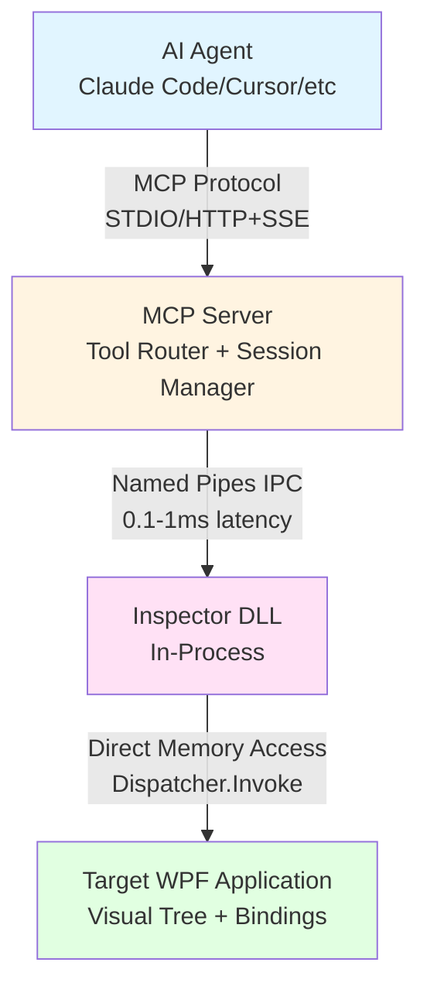

# WPF DevTools MCP Server


A Model Context Protocol (MCP) server that enables AI agents to deeply inspect and interact with running WPF applications through in-process DLL injection.

## Features

### Core Capabilities

- **Process Management**: Discover and connect to running WPF applications
- **Visual Tree Inspection**: Browse and analyze the Visual and Logical trees
- **Binding Diagnostics**: Detect and diagnose binding errors and DataContext chains
- **MVVM Support**: Inspect ViewModels, execute commands, and modify properties
- **DependencyProperty Analysis**: Analyze value sources, metadata, and precedence
- **Style & Template Inspection**: Examine applied styles, triggers, and templates
- **RoutedEvent Tracing**: Trace event routing and fire custom events
- **Layout Analysis**: Inspect layout information, clipping, and transforms
- **Performance Diagnostics**: Measure render statistics and detect binding leaks
- **Element Interaction**: Click elements, simulate keyboard input, and capture screenshots

### Unique Value Proposition

First free, open-source MCP server providing WPF-specific deep inspection capabilities that are impossible with out-of-process tools:
- Direct access to `BindingOperations`, `DependencyPropertyHelper`, and Visual Tree internals
- In-process execution for accurate binding error detection
- Real-time property change watching
- Command execution with CanExecute validation

## Installation

### Prerequisites

- .NET 8.0 SDK or later
- .NET Framework 4.8 targeting pack (for multi-targeting support)
- Windows 10 or later
- Administrator privileges may be required for DLL injection
- Target WPF application must be running
- Visual Studio 2022 or VS Code (optional)

### Build from Source

```bash
git clone https://github.com/Evanlau1798/wpf-devtools-mcp.git
cd wpf-devtools-mcp
dotnet build
```

### Run Tests

```bash
dotnet test
```

## Configuration

### Claude Desktop

Add to `claude_desktop_config.json`:

```json
{
  "mcpServers": {
    "wpf-devtools": {
      "command": "dotnet",
      "args": ["run", "--project", "/path/to/wpf-devtools-mcp/src/WpfDevTools.Mcp.Server/WpfDevTools.Mcp.Server.csproj"],
      "env": {}
    }
  }
}
```

> **Note**: Replace `/path/to/wpf-devtools-mcp` with your actual installation directory.

### Cursor

Add to `.cursor/mcp.json`:

```json
{
  "mcp": {
    "servers": {
      "wpf-devtools": {
        "command": "dotnet",
        "args": ["run", "--project", "/path/to/wpf-devtools-mcp/src/WpfDevTools.Mcp.Server/WpfDevTools.Mcp.Server.csproj"]
      }
    }
  }
}
```

> **Note**: Replace `/path/to/wpf-devtools-mcp` with your actual installation directory.

### VS Code with MCP Extension

Add to `settings.json`:

```json
{
  "mcp.servers": {
    "wpf-devtools": {
      "command": "dotnet",
      "args": ["run", "--project", "/path/to/wpf-devtools-mcp/src/WpfDevTools.Mcp.Server/WpfDevTools.Mcp.Server.csproj"],
      "transport": "stdio"
    }
  }
}
```

> **Note**: Replace `/path/to/wpf-devtools-mcp` with your actual installation directory.

## Quick Start

### Using with an AI Agent (Recommended)

After configuring your AI client (see Configuration above), simply ask your AI agent:

1. **"List all running WPF processes"** → Uses `get_processes`
2. **"Connect to process [PID]"** → Uses `connect`
3. **"Show me the visual tree"** → Uses `get_visual_tree`
4. **"Find any binding errors"** → Uses `get_binding_errors`

### Manual Testing (Developer Mode)

Start the MCP server directly:

```bash
dotnet run --project src/WpfDevTools.Mcp.Server/
```

The server communicates via STDIO using the MCP protocol.

### Raw MCP Protocol (Advanced)

For direct protocol interaction, the server accepts JSON-RPC messages over STDIO.

List running WPF applications:

```json
{
  "jsonrpc": "2.0",
  "id": 1,
  "method": "tools/call",
  "params": {
    "name": "get_processes"
  }
}
```

Connect to a specific process:

```json
{
  "jsonrpc": "2.0",
  "id": 2,
  "method": "tools/call",
  "params": {
    "name": "connect",
    "arguments": {
      "processId": 12345
    }
  }
}
```

Inspect the Visual Tree:

```json
{
  "jsonrpc": "2.0",
  "id": 3,
  "method": "tools/call",
  "params": {
    "name": "get_visual_tree",
    "arguments": {
      "processId": 12345,
      "depth": 3
    }
  }
}
```

## Usage with AI Agents

Once configured, AI agents can interact with WPF applications using natural language:

**Example 1: Debugging Binding Errors**
```
"Show me all binding errors in the running WPF application"
→ Agent uses: get_processes → connect → get_binding_errors
```

**Example 2: Inspecting UI Structure**
```
"What's the visual tree structure of the main window?"
→ Agent uses: get_processes → connect → get_visual_tree
```

**Example 3: Testing User Interactions**
```
"Click the 'Submit' button and check if the command executed"
→ Agent uses: get_visual_tree (find button) → click_element → get_commands
```

**Example 4: MVVM Debugging**
```
"What's the current DataContext and what commands are available?"
→ Agent uses: get_viewmodel → get_commands
```

**Example 5: Performance Analysis**
```
"Find potential binding memory leaks in the application"
→ Agent uses: find_binding_leaks → get_bindings (for details)
```

## Security

WPF DevTools MCP Server includes multiple layers of security to protect Named Pipe IPC communication.

### Authentication

Challenge-Response authentication using HMAC-SHA256 prevents unauthorized connections to Inspector DLLs.

**How it works**:
1. Inspector generates a 32-byte random challenge
2. MCP Server computes HMAC-SHA256 response using the shared secret
3. Inspector verifies the response using constant-time comparison
4. Connection proceeds only if authentication succeeds

**Configuration**:

```bash
# Set shared secret (base64-encoded, minimum 32 bytes)
export WPFDEVTOOLS_AUTH_SECRET=$(openssl rand -base64 32)
```

If `WPFDEVTOOLS_AUTH_SECRET` is not set, a random secret is auto-generated per session.

### Communication Encryption

All Named Pipe communication can be encrypted using TLS 1.2 over SslStream with self-signed X.509 certificates.

**Features**:
- RSA 2048-bit self-signed certificates with auto-generation and file persistence
- TLS 1.2 encryption (TLS 1.3 is incompatible with Named Pipes on Windows)
- Certificate reuse across sessions (stored in `%APPDATA%\WpfDevTools\certs\`)
- Machine-specific PFX password protection

### Async Logging

Both MCP Server and Inspector use non-blocking async logging via bounded Channel queues:
- No UI thread blocking even under high error frequency
- Automatic log rotation at 10 MB
- Background queue processing with graceful shutdown flush

### Environment Variables

| Variable | Description | Default |
|----------|-------------|---------|
| `WPFDEVTOOLS_AUTH_SECRET` | Base64-encoded shared secret (min 32 bytes) | Auto-generated |
| `WPFDEVTOOLS_REQUIRE_SIGNATURE` | Require Authenticode DLL signature | `0` (disabled) |

For production deployment guidance, see [Security Policy](SECURITY.md).

## Architecture



### Key Design Decisions

- **In-Process Injection**: Required for accessing WPF internals (see [ADR-002](docs/architecture/ADR-002-in-process-injection.md))
- **Named Pipes**: Message mode with length-prefix framing (see [ADR-001](docs/architecture/ADR-001-named-pipes-for-ipc.md) and [ADR-003](docs/architecture/ADR-003-length-prefix-framing.md))
- **UI Thread Marshalling**: All Visual Tree operations use `Dispatcher.Invoke()`
- **Token Efficiency**: All tools support `depth`, `filter`, `compact` parameters
- **Multi-Targeting**: Supports .NET 8.0 and .NET Framework 4.8 (see [ADR-005](docs/architecture/ADR-005-multi-targeting-strategy.md))

## MCP Tools (44 Total)

### 1. Process Management (3 tools)

#### get_processes
List all running WPF applications.

**Parameters**: None

**Returns**: Array of process information (PID, processName, windowTitle, architecture, .NET version)

#### connect
Connect to a WPF application (performs injection if needed).

**Parameters**:
- `processId` (required): Process ID to connect to

**Returns**: Connection status

#### ping
Verify connection health and measure latency.

**Parameters**:
- `processId` (required): Process ID

**Returns**: Latency in milliseconds

### 2. Tree & XAML (6 tools)

#### get_visual_tree
Retrieve the Visual Tree structure.

**Parameters**:
- `processId` (required): Process ID
- `depth` (optional): Maximum tree depth (default: unlimited)
- `filter` (optional): Filter by element type
- `compact` (optional): Return minimal properties (default: false)

**Returns**: Visual Tree structure

#### get_logical_tree
Retrieve the Logical Tree structure.

**Parameters**: Same as `get_visual_tree`

**Returns**: Logical Tree structure

#### compare_trees
Compare Visual and Logical trees to identify differences.

**Parameters**:
- `processId` (required): Process ID

**Returns**: Comparison result with differences highlighted

#### serialize_to_xaml
Serialize element to XAML.

**Parameters**:
- `processId` (required): Process ID
- `elementId` (optional): Element ID (default: root)

**Returns**: XAML string

#### get_namescope
Get NameScope for element lookup.

**Parameters**:
- `processId` (required): Process ID
- `elementId` (optional): Element ID (default: root)

**Returns**: NameScope dictionary

#### get_template_tree
Get the template Visual Tree.

**Parameters**:
- `processId` (required): Process ID
- `elementId` (required): Element ID
- `depth` (optional): Maximum tree depth (default: unlimited, max: 100)

**Returns**: Template tree structure

### 3. Binding Diagnostics (5 tools)

#### get_bindings
Get all bindings for an element or tree.

**Parameters**:
- `processId` (required): Process ID
- `elementId` (optional): Element ID (default: root)
- `recursive` (optional): Include child elements (default: false)

**Returns**: Array of binding information

#### get_binding_errors
Get all binding errors in the application.

**Parameters**:
- `processId` (required): Process ID

**Returns**: Array of binding errors with details

#### get_binding_value_chain
Get the complete value resolution chain for a binding.

**Parameters**:
- `processId` (required): Process ID
- `elementId` (required): Element ID
- `propertyName` (required): Property name

**Returns**: Value chain from source to target

#### get_datacontext_chain
Get the DataContext inheritance chain.

**Parameters**:
- `processId` (required): Process ID
- `elementId` (optional): Element ID (default: root)

**Returns**: DataContext chain from element to root

#### force_binding_update
Force a binding to update.

**Parameters**:
- `processId` (required): Process ID
- `elementId` (required): Element ID
- `propertyName` (required): Property name

**Returns**: Update result

### 4. DependencyProperty (5 tools)

#### get_dp_value_source
Get the value source for a DependencyProperty.

**Parameters**:
- `processId` (required): Process ID
- `elementId` (required): Element ID
- `propertyName` (required): Property name

**Returns**: Value source (Local, Style, Template, Inherited, Default)

#### get_dp_metadata
Get metadata for a DependencyProperty.

**Parameters**:
- `processId` (required): Process ID
- `propertyName` (required): Property name

**Returns**: Property metadata

#### set_dp_value
Set a DependencyProperty value.

**Parameters**:
- `processId` (required): Process ID
- `elementId` (required): Element ID
- `propertyName` (required): Property name
- `value` (required): New value

**Returns**: Success status

#### clear_dp_value
Clear a DependencyProperty local value.

**Parameters**:
- `processId` (required): Process ID
- `elementId` (required): Element ID
- `propertyName` (required): Property name

**Returns**: Success status

#### watch_dp_changes
Watch for DependencyProperty changes.

**Parameters**:
- `processId` (required): Process ID
- `elementId` (required): Element ID
- `propertyName` (required): Property name

**Returns**: Subscription ID (events pushed via SSE)

### 5. Style/Template (4 tools)

#### get_applied_styles
Get all applied styles for an element.

**Parameters**:
- `processId` (required): Process ID
- `elementId` (required): Element ID

**Returns**: Array of applied styles

#### get_triggers
Get all triggers for an element.

**Parameters**:
- `processId` (required): Process ID
- `elementId` (required): Element ID

**Returns**: Array of triggers with conditions

#### get_resource_chain
Get the resource lookup chain.

**Parameters**:
- `processId` (required): Process ID
- `elementId` (required): Element ID
- `resourceKey` (required): Resource key

**Returns**: Resource chain from element to application

#### override_style_setter
Override a style setter value.

**Parameters**:
- `processId` (required): Process ID
- `elementId` (required): Element ID
- `propertyName` (required): Property name
- `value` (required): New value

**Returns**: Success status

### 6. RoutedEvent (3 tools)

#### trace_routed_events
Trace routed event propagation.

**Parameters**:
- `processId` (required): Process ID
- `eventName` (required): Event name

**Returns**: Event trace (tunneling → bubbling)

#### get_event_handlers
Get all handlers for a routed event.

**Parameters**:
- `processId` (required): Process ID
- `elementId` (required): Element ID
- `eventName` (required): Event name

**Returns**: Array of event handlers

#### fire_routed_event
Fire a routed event.

**Parameters**:
- `processId` (required): Process ID
- `elementId` (required): Element ID
- `eventName` (required): Event name

**Returns**: Success status

### 7. Interaction (5 tools)

#### click_element
Simulate a mouse click on an element.

**Parameters**:
- `processId` (required): Process ID
- `elementId` (required): Element ID

**Returns**: Success status

#### drag_and_drop
Simulate drag and drop.

**Parameters**:
- `processId` (required): Process ID
- `sourceElementId` (required): Source element ID
- `targetElementId` (required): Target element ID
- `dataFormat` (optional): Data format (default: "Text")

**Returns**: Success status

#### scroll_to_element
Scroll an element into view.

**Parameters**:
- `processId` (required): Process ID
- `elementId` (required): Element ID

**Returns**: Success status

#### simulate_keyboard
Simulate keyboard input.

**Parameters**:
- `processId` (required): Process ID
- `elementId` (required): Element ID
- `key` (required): Key name (e.g., "A", "Enter", "Escape", "Tab")
- `eventType` (optional): "KeyDown" or "KeyUp" (default: "KeyDown")

**Returns**: Success status

#### element_screenshot
Capture a screenshot of an element.

**Parameters**:
- `processId` (required): Process ID
- `elementId` (required): Element ID

**Returns**: Base64-encoded PNG image

### 8. Layout (4 tools)

#### get_layout_info
Get layout information for an element.

**Parameters**:
- `processId` (required): Process ID
- `elementId` (required): Element ID

**Returns**: Layout information (ActualWidth, ActualHeight, DesiredSize, RenderSize)

#### highlight_element
Highlight an element in the UI.

**Parameters**:
- `processId` (required): Process ID
- `elementId` (required): Element ID
- `color` (optional): Highlight color (default: "Red")
- `duration` (optional): Highlight duration in ms (default: 2000)

**Returns**: Success status

#### get_clipping_info
Get clipping information for an element.

**Parameters**:
- `processId` (required): Process ID
- `elementId` (required): Element ID

**Returns**: Clipping geometry

#### invalidate_layout
Force a layout update.

**Parameters**:
- `processId` (required): Process ID
- `elementId` (optional): Element ID (default: root)

**Returns**: Success status

### 9. MVVM (5 tools)

#### get_viewmodel
Get ViewModel from DataContext.

**Parameters**:
- `processId` (required): Process ID
- `elementId` (required): Element ID

**Returns**: ViewModel type and properties

#### get_commands
Get all ICommand properties from ViewModel.

**Parameters**:
- `processId` (required): Process ID
- `elementId` (required): Element ID

**Returns**: Array of commands with CanExecute status

#### execute_command
Execute a command.

**Parameters**:
- `processId` (required): Process ID
- `elementId` (required): Element ID
- `commandName` (required): Command name
- `parameter` (optional): Command parameter

**Returns**: Execution result

#### modify_viewmodel
Modify a ViewModel property.

**Parameters**:
- `processId` (required): Process ID
- `elementId` (required): Element ID
- `propertyName` (required): Property name
- `value` (required): New value

**Returns**: Success status

#### get_validation_errors
Get all validation errors.

**Parameters**:
- `processId` (required): Process ID
- `elementId` (optional): Element ID (default: all)

**Returns**: Array of validation errors

### 10. Performance (4 tools)

#### get_render_stats
Get rendering statistics.

**Parameters**:
- `processId` (required): Process ID

**Returns**: Frame rate, frame time, visual count

#### find_binding_leaks
Find potential binding memory leaks.

**Parameters**:
- `processId` (required): Process ID
- `threshold` (optional): Leak threshold (default: 100)

**Returns**: Array of potential leaks

#### measure_element_render_time
Measure element render time.

**Parameters**:
- `processId` (required): Process ID
- `elementId` (optional): Element ID (default: root)

**Returns**: Render time in milliseconds

#### get_visual_count
Get visual element count.

**Parameters**:
- `processId` (required): Process ID
- `elementId` (optional): Element ID (default: root)

**Returns**: Total visual element count

## SDK Mode (Opt-in)

For applications that cannot use DLL injection (single-file apps, Native AOT, etc.), use the SDK mode:

### Installation

> **⚠️ Note**: Currently requires building from source. NuGet package coming soon.

**Step 1: Build the SDK project**

```bash
# Navigate to the SDK project directory
cd src/WpfDevTools.Inspector.Sdk/

# Build the SDK for your target framework
dotnet build -c Release

# The output DLL will be in:
# bin/Release/net8.0-windows/WpfDevTools.Inspector.Sdk.dll
```

**Step 2: Reference the SDK in your WPF application**

Option A: Add project reference (if in same solution):
```bash
dotnet add reference path/to/WpfDevTools.Inspector.Sdk/WpfDevTools.Inspector.Sdk.csproj
```

Option B: Add DLL reference directly:
```xml
<!-- In your .csproj file -->
<ItemGroup>
  <Reference Include="WpfDevTools.Inspector.Sdk">
    <HintPath>path\to\WpfDevTools.Inspector.Sdk.dll</HintPath>
  </Reference>
</ItemGroup>
```

### Usage

```csharp
using WpfDevTools.Inspector.Sdk;

public partial class App : Application
{
    protected override void OnStartup(StartupEventArgs e)
    {
        base.OnStartup(e);
        InspectorSdk.Initialize();
    }

    protected override void OnExit(ExitEventArgs e)
    {
        InspectorSdk.Shutdown();
        base.OnExit(e);
    }
}
```

## HTTP+SSE Transport

> **⚠️ Note**: HTTP+SSE transport is planned but not yet implemented. Currently only STDIO transport is supported.

For web-based AI agents, HTTP+SSE transport will be available in a future release:

```bash
# Planned feature - not yet available
dotnet run --project src/WpfDevTools.Mcp.Server/ -- --transport http --port 3000
```

### Planned Endpoints

- `POST /mcp` - Send MCP requests
- `GET /events` - Subscribe to SSE events (property changes, etc.)

## Troubleshooting

### DLL Injection Fails

**Symptom**: `connect` tool returns "Injection failed"

**Possible Causes**:
1. Architecture mismatch (x86 vs x64)
2. Antivirus blocking injection
3. Self-contained single-file app
4. Native AOT app

**Solutions**:
1. Ensure MCP Server architecture matches target app
2. Add exception to antivirus
3. Use SDK mode instead

### Binding Errors Not Detected

**Symptom**: `get_binding_errors` returns empty array

**Possible Causes**:
1. Binding errors occur before connection
2. PresentationTraceSources not enabled

**Solutions**:
1. Connect early in application lifecycle
2. Enable PresentationTraceSources in app.config

### Named Pipe Connection Timeout

**Symptom**: Connection hangs or times out

**Possible Causes**:
1. Inspector DLL failed to initialize
2. UI thread blocked
3. Firewall blocking Named Pipes

**Solutions**:
1. Check MCP Server log: `%TEMP%\WpfDevTools_McpServer_<timestamp>.log`
   Check Inspector log: `%TEMP%\WpfDevTools_Inspector_<PID>.log`
2. Ensure UI thread is responsive
3. Allow Named Pipes in firewall

### Performance Issues

**Symptom**: Application becomes slow after connection

**Possible Causes**:
1. Deep tree traversal with no depth limit
2. Too many property change watchers
3. Frequent screenshot captures

**Solutions**:
1. Use `depth` parameter to limit tree traversal
2. Unwatch properties when done
3. Capture screenshots sparingly

## Supported Platforms

### Operating Systems
- Windows 10 (version 1809 or later)
- Windows 11
- Windows Server 2019 or later

### .NET Versions
- .NET 8.0 or later (MCP Server)
- .NET Framework 4.8 or later (Target WPF applications)
- Multi-targeting support for both .NET 8.0 and .NET Framework 4.8

### Architectures
- x86 (32-bit)
- x64 (64-bit)
- ARM64 (Windows on ARM)

> **Note**: The Inspector DLL must match the target application's architecture.

### Known Limitations
- **Self-contained single-file apps**: Cannot inject DLL (use SDK mode)
- **Native AOT apps**: Cannot inject DLL (use SDK mode)
- **Trimmed apps**: May fail if required dependencies are removed
- **Antivirus software**: May block DLL injection (requires code signing or exceptions)
- **Protected processes**: Cannot inject into system processes or protected applications

## Development

### Project Structure

```
src/
├── WpfDevTools.Mcp.Server/       # MCP Server (STDIO/HTTP)
├── WpfDevTools.Inspector/        # Injected DLL
├── WpfDevTools.Inspector.Sdk/    # Opt-in SDK
├── WpfDevTools.Injector/         # DLL injection
└── WpfDevTools.Shared/           # Shared types

tests/
├── WpfDevTools.Tests.Unit/       # Unit tests
├── WpfDevTools.Tests.Integration/ # Integration tests
└── WpfDevTools.Tests.TestApp/    # Test WPF app
```

### Build Commands

```bash
# Build all projects
dotnet build

# Run tests
dotnet test

# Run with coverage
dotnet test /p:CollectCoverage=true

# Build release
dotnet build -c Release

# Build for specific architecture (must match target WPF app)
dotnet build -r win-x64
dotnet build -r win-x86
dotnet build -r win-arm64
```

### Contributing

We welcome contributions! Please see [CONTRIBUTING.md](CONTRIBUTING.md) for detailed guidelines on:

- Coding standards and best practices
- Test-driven development workflow
- Branch naming and commit format
- Pull request process
- Code review checklist

## Roadmap

- **Phase 1 (Current)**: Core inspection tools, STDIO transport, DLL injection
- **Phase 2**: HTTP+SSE transport for web-based AI agents, improved MVVM tooling
- **Phase 3**: Performance diagnostics, advanced event tracing, SDK NuGet package
- **Phase 4**: VS Code extension, MCP Prompt Templates, community plugins

See [docs/proposal.md](docs/proposal.md) for the full development plan.

## License

MIT License - see LICENSE file for details

## Acknowledgments

- DLL injection based on [Snoop WPF](https://github.com/snoopwpf/snoopwpf) (Ms-PL)
- MCP Protocol by [Anthropic](https://modelcontextprotocol.io/)
