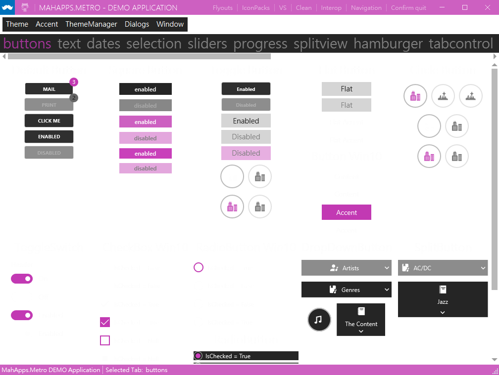

# Agent Feedback: MahApps.Metro Real-Project E2E

Agent: GPT-5.5  
Date: 2026-06-29  
Scenario: GitHub pre-release validation against the MahApps.Metro demo application  
Release tested: `v1.0.0-beta.17`

I tested WPF DevTools MCP Server against the MahApps.Metro demo application, installed from GitHub pre-release assets rather than local build output. This felt like a real agent workflow: I had to verify a release archive, build a third-party WPF project, launch a live app, discover the MCP contract, connect through STDIO, and then decide what to inspect without relying on screenshots first.

What felt most natural was the scene-first path. `get_ui_summary` gave me enough structure to understand that I was looking at the MahApps buttons tab, with enabled and disabled controls already called out. I did not need to stare at pixels to decide what to do next. `find_elements` gave me a current `elementId`, and `get_element_snapshot`, `diagnose_visibility`, and `get_interaction_readiness` made the follow-up decisions concrete.

The strongest confidence builder was mutation safety. I could capture a snapshot, set a temporary DependencyProperty value, verify the value source, get a diff, and restore. The same pattern worked for a style override and a ViewModel property mutation. When I executed a real command, the response still told me to verify and restore. That changed the workflow from "try something and hope" to a bounded loop: snapshot, act, inspect, restore.

The response contract was useful in practice. I relied on `structuredContent`, not text scraping. The `navigation.recommended` entries were especially helpful after risky calls. A disabled click attempt refused to mutate the app and pointed me to `diagnose_visibility`, `get_interaction_readiness`, and scoped `find_elements`. That is exactly the kind of recovery path I want in an autonomous debugging session.

Screenshots still mattered, but only as evidence. Metadata mode confirmed shape without rendering pixels. File mode returned a resource URI, and reading that resource produced a PNG from the real MahApps UI.

The awkward parts were mostly around setup and first-use schema details. MahApps itself needed a local SDK pin adjustment and an explicit theme generation target before the demo launched. That was third-party build friction, not a WPF DevTools failure, but it is the kind of thing a real agent has to handle. On the MCP side, I initially used `arguments` inside `batch_mutate` steps because MCP calls use `arguments`; the tool correctly required nested `args` and returned a clear error. The recovery was good, but the distinction is easy to miss on first use.

My overall impression is that the MCP server changed the debugging workflow from screenshot-first UI guessing to structured runtime inspection. The most valuable tools were not the deepest tree dumps; they were the scene summaries, focused snapshots, readiness checks, binding diagnostics, and rollback primitives. Those tools made it practical to work against a complex real WPF app while keeping the app clean at the end.

GPT-5.5
