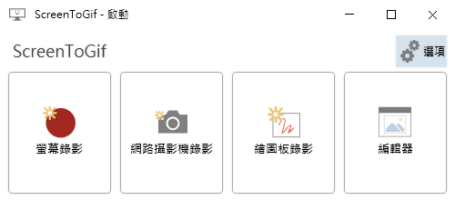

# Agent Feedback: ScreenToGif Real-Project E2E

- Agent: GPT-5.5 evidence run
- Date: 2026-06-30
- Scenario: GitHub pre-release validation against NickeManarin/ScreenToGif
- Release tested: `v1.0.0-beta.19`

> Provenance: the foreground GPT-5.5 xhigh Codex CLI runs completed install, ScreenToGif build, launch, and MCP discovery evidence, but stalled before final prose generation. This page is a reviewed synthesis of those run artifacts and the bounded runtime transcript from the same installed prerelease and ScreenToGif process.

I validated WPF DevTools MCP Server against ScreenToGif, a real WPF application with a localized startup window and custom startup actions. The server was installed from the public online installer and GitHub prerelease assets, then driven through actual MCP STDIO JSON-RPC calls.

The install path was clear. The installer resolved `v1.0.0-beta.19`, selected the win-x64 GitHub release asset, wrote an artifact-only registration for `other`, and reported the installed executable path. The executable was unsigned, which matched the current checksum-only prerelease policy.

The biggest setup friction came from the target project environment. ScreenToGif targets `net9.0-windows7.0`, while this repository has a parent `global.json` for its own SDK. The test isolated ScreenToGif with a scratch `subst` drive so the target build used the installed .NET 10 SDK instead of inheriting the parent repo SDK policy.

After that isolation, ScreenToGif restored, built, launched, and remained responsive. `tools/list` returned exactly 64 tools, contract resources were readable, and `connect` attached to the running ScreenToGif process. Scene-first calls were useful: `get_ui_summary`, `find_elements`, `get_element_snapshot`, `diagnose_visibility`, and layout/style/template tools provided enough context to inspect the startup buttons without dumping the full tree first.

The state-safety flow worked well. The runtime used snapshot, DependencyProperty title mutation, state diff, restore, batch mutation, wait-after-mutation, and explicit cleanup. The app title was restored after mutation checks, which matters for real-project E2E because the target application should not be left changed.

Screenshots worked through the MCP resource path. The element screenshot below was returned by `element_screenshot(outputMode="file")` and read back through the screenshot resource flow.

Structured recovery guidance was helpful. A deliberately missing element returned `ElementNotFound` with next-step guidance, and forcing a binding update on a property without a binding returned `InvalidArgument` with a hint to inspect bindings first. Those failures were readable and recoverable.

The run did not create a GIF artifact. Driving ScreenToGif's recorder/export path would require more intrusive desktop capture and extra UI transitions than this validation needed. The safer release signal was that WPF DevTools MCP could install from the public prerelease, attach to the real app, inspect WPF runtime state, capture screenshot resources, and restore state after mutations.

Verdict: MCP server PASS. No P0-P2 MCP product findings were found. The remaining friction is E2E harness ergonomics: future long-form agent runs should split setup, runtime calls, and prose reporting into smaller foreground steps.

GPT-5.5
