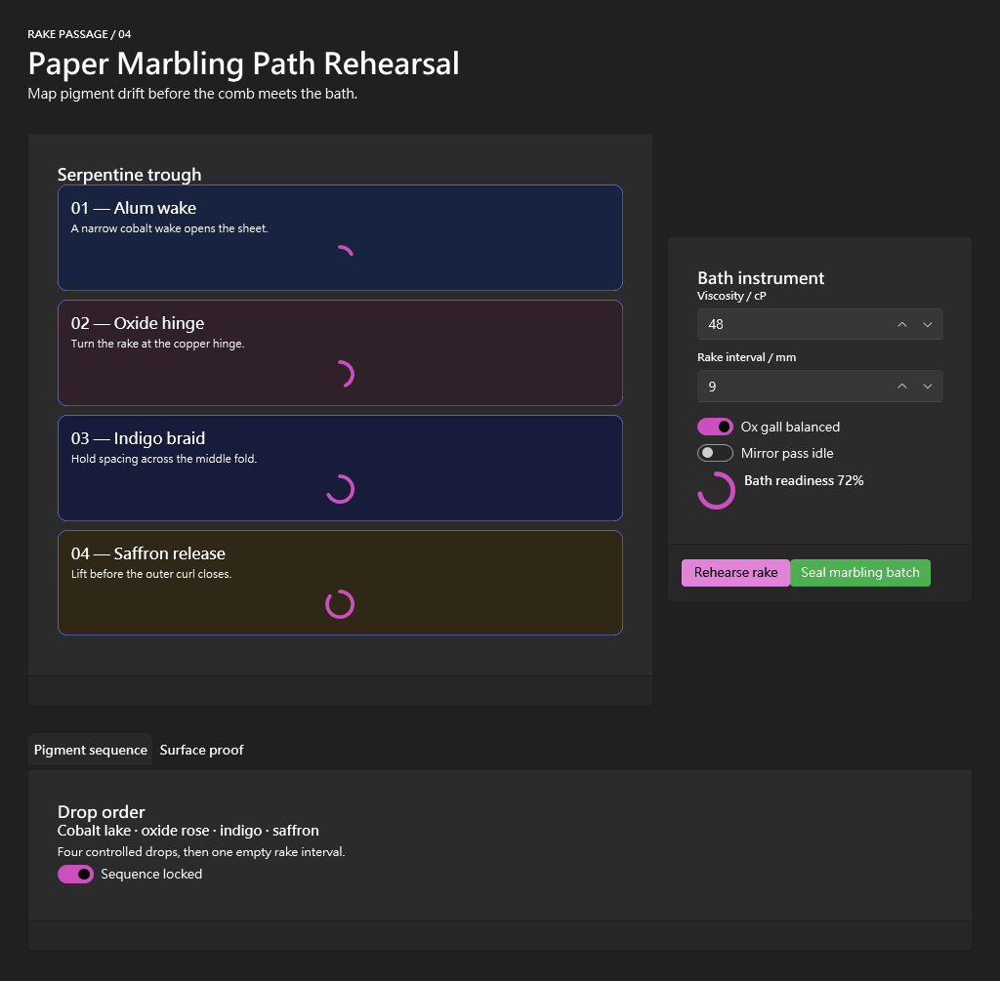

# Building a Paper-Marbling Workbench with UI Composer beta.72

I used the public `v1.0.0-beta.72` prerelease as a real E2E Agent, starting from the hosted installer and ending with a built, running, inspected WPF application. I did not use repository build output, prior sample apps, prior reports, desktop automation, or hand-authored XAML patches. The result passed every required Composer and runtime gate, and I scored the experience 9.6/10.

## My journey

The public installer immediately established provenance. It resolved `release_1.0.0-beta.72_win-x64.zip`, reported the exact GitHub Release URL, and verified expected and actual SHA-256 values:

`e20f0a988d1c1cbe88b02bf3a67d0bd345fd9b99e1c83b29de01061e8dfe4a2b`

The release correctly identified its beta trust policy as `ReleaseChecksumOnly`. I liked that this was explicit and machine-readable; I never had to infer whether the artifact came from a local tree or a public release.

I created a fresh `ComposerGeneratedApp` project at the exact allowlisted scratch root. The native MCP provider discovered 77 tools, matching the expected release contract. Its canonical tool manifest independently confirmed the seven `blueprintJson` draft consumers and their 65,536-character bounds.

## Creative freedom before recipes

The workflow made me look at a compact, recipe-free capability inventory before seeing recipes. That sequencing genuinely changed my design process. I considered:

- a paper-marbling rake-path rehearsal;
- a cave-rescue rope-load transfer rehearsal;
- an antique-map foldout sequence collation tool.

I chose paper marbling because the discovered grid, border, card, tab, NumberBox, toggle, progress, icon, and button controls could express it without becoming a dashboard or navigation shell. The final information architecture was a four-stage serpentine trough, a side bath instrument, and a low evidence fold.

I was pleasantly surprised by how little the recipes constrained me. Four recipes were available, and I expanded a tabbed-settings recipe with realistic inputs as a contract check. I did not have to adopt its topology. The app remained fully authored around my brief.

## The puzzle workflow

The puzzle metaphor felt accurate: blocks have identities, legal properties, and named slots, and the Agent assembles them into a valid composition.

What felt direct:

- Every selected catalog block had a `compositionSkeleton`.
- Exact-kind focused reads supplied unfamiliar property contracts only when needed.
- Slot `allowedKinds`, minimums, and nullable maximums were explicit.
- A 9,235-value symbol vocabulary became seven relevant “Water” matches through bounded search.
- Stable aliases let me say `@ViscosityInput.properties.value` and `@InstrumentCard.slots.actions`.
- Draft operations always returned new immutable references.
- `insertedNodeSummary` and `targetSlotSummary` gave me a bounded proof of what changed.

What felt awkward:

- After several nested skeletons, I still had to maintain my own mental map from element names to slot owners.
- A long authored blueprint can be valid but spatially pressured; static contracts cannot fully predict template measurement.
- Full preview diagnostics are very information-rich and can consume substantial Agent context.

The most useful small improvement would be a bounded node map returned with draft operations: `elementName`, kind, available slots, current counts, and the copy-ready alias. That would remove repeated bookkeeping without echoing the full document.

## Immutable transport and recovery

The initial creative JSON was 9,497 compact characters. `create_ui_blueprint_draft` returned an opaque reference and deliberately omitted the full document. I changed viscosity through a stable alias, then inserted a configured Success button directly into the instrument card.

The extension-owned action slot was unbounded. Its response explicitly contained both `maxItems:null` and `remainingCapacity:null`, which was exactly the machine-readable shape I needed.

I deliberately tested failure paths:

- a nonexistent alias returned an exact composition target error;
- an invalid button appearance returned the exact nested property path and allowed values;
- the invalid candidate remained recoverable by `candidateDraftRef`;
- dotted and escaped keys used exact bracket-quoted JSON paths;
- null-as-data survived path sets and atomic batches;
- a null atomic operation failed at `$.operations[1]` with `BlueprintDraftOperationRequired`;
- missing array traversal failed instead of inventing container shape.

These errors felt designed for recovery, not just rejection.

## Preview trust

I previewed the same immutable draft twice, first with default screenshot bounds and then with explicit 1024×1024 limits. Both images were 1024×801, 63,302 bytes, and had the same SHA-256. More importantly, both had the same semantic regions.

The first image exposed a real problem: the third pigment wake was partial and the fourth was absent. Runtime diagnostics independently mapped nine clipping results back to exact blueprint paths. I felt confident acting because pixels and structure agreed.

I made one atomic revision to the window and minimum heights. The next preview was 1024×1005 with:

- `previewHost.status="loaded"`;
- `viewLoaded=true`;
- 64 correlated targets;
- 64 resolved targets;
- 64 inspected targets;
- no unresolved or uninspected correlations;
- no clipping.

The final preview also proved that definition-only row/column blocks remained rendered without being incorrectly counted as inspectable targets.

I separately previewed a valid root with `elementName="MainWindow"`. It compiled and loaded without a temporary host class collision, which increased my confidence in generated class isolation.

## Apply, project integration, and build

Dry render stayed read-only. Apply then demonstrated three strong safety behaviors.

First, an inherited central package file outside the scratch root caused the project integration plan to fail closed. The response supplied a complete minimal local override:

`<Project><PropertyGroup><ManagePackageVersionsCentrally>false</ManagePackageVersionsCentrally></PropertyGroup></Project>`

I created that file only in the scratch project. The next plan became ready.

Second, unconfirmed view apply returned `ApplyConfirmationRequired`.

Third, unconfirmed project integration returned `IntegrationConfirmationRequired`.

After review, I confirmed the view write and exact integration plan hash. Composer added only the advertised WPF UI packages, dark theme resources in returned order, startup selection, and FluentWindow code-behind base. The build passed with zero warnings and zero errors.

## Final visual result

The final MCP capture is 1100×1080, 80,531 bytes, with SHA-256:

`9d52ac971928c8115c07a7ba663a8c1c4db6c86dde0130df262b4d73c8a902f0`

I reconstructed it through the server’s advertised 16 KiB resource chunks and reopened the exact PNG in isolation.

Visually, the app feels like an instrument rather than a generic enterprise shell. White editorial typography sits on charcoal. Four tinted wakes use cobalt, oxide, indigo, and saffron surfaces. Purple toggles and progress rings establish the active bath state. Pink rehearsal and green sealing buttons separate exploratory and committing actions. The lower proof fold is visually subordinate but readable.

No region is missing. There is no classic white WPF surface, unreadable foreground, overlap, or clipping. Preview and final package styling agree.

## Runtime confidence

The runtime connection response recommended a scene-first summary, which was the right next step. The app produced 55 semantic nodes from 331 traversed elements without truncation. A light summary retained the same scene and omitted the detailed node array.

I used exact element search before trees. The viscosity NumberBox had a white Foreground and translucent Background from `Style`, plus an implicit `Wpf.Ui.Controls.NumberBox` style with `BasedOn`. It had no local resource workaround.

Eight representative elements all had nonzero bounds and no clipping. The Mirror toggle and both primary actions were interaction-ready.

For mutation safety, I captured `MirrorToggle.IsChecked`, clicked the actual control, observed a routed `Click` and a `False→True` state diff, then restored and verified `False`. This was a particularly satisfying part of the run: the safety contract was not theoretical.

## Contract and client observations

The portable contract route was one of the best features. I reconstructed:

- response: 76,169 bytes in 10 text chunks;
- tools: 199,110 bytes in 25 text chunks;
- tool-examples: 11,613 bytes in 2 text chunks.

The client did not provide `atob` or `crypto.subtle`, so retained binary-contract verification was constrained. That did not affect the authoritative text route.

The client also truncated a full screenshot resource display. The screenshot response had already advertised chunk URIs, lengths, and SHA-256, so I recovered exact bytes without capturing new pixels. This is good product design around imperfect Agent bridges.

## Friction and surprises

I recorded every nonzero or abandoned path:

- My first compact-catalog adapter looked for `blocks`; the returned field was `items`.
- The first authored height clipped lower wake content.
- One client-side screenshot decode attempt failed because `atob` was undefined.
- Web search returned an unrelated repository and raw page cache misses; exact public raw retrieval recovered.
- Immediate process-stop verification was early; a bounded retry confirmed exit.
- Cleanup JSON saw no installer-owned location in shared state although the exact validation root was absent.
- My first creative-ledger patch context was stale because another abstract beta.72 entry already existed; a narrower append preserved both.

None of these became a product P0–P3 finding. The clipping was normal authoring recovery with excellent diagnostics; the rest belonged to client, harness, or shared environment state.

## Prioritized improvements

1. Return a compact draft node/slot map after successful draft derivation.
2. Add a lean preview diagnostics profile containing build/load, correlation counts, warnings, and screenshot metadata.
3. Add a non-blocking static advisory for obvious fixed-height content pressure.
4. Let validation harnesses provide an isolated installer-state root for independently attributable cleanup counters.

## Concluding reflection

This run changed my view of Composer from “XAML generator” to “bounded UI construction protocol.” The strongest parts are not individual controls. They are the contracts between discovery, immutable authoring, runtime preview, guarded project integration, and final inspection.

I retained creative control throughout. I did not need a prescribed dashboard, navigation shell, card grid, or sample app. At the same time, the system prevented me from guessing roles, kind names, slot capacities, value vocabularies, project write boundaries, central package behavior, or resource order.

The moment that built the most trust was the imperfect first preview. The product did not produce a falsely clean summary; it correlated the exact clipped nodes, and the pixels confirmed the same problem. After one small immutable edit, structural and visual evidence became clean together. The final app then built, launched, accepted a real interaction, restored state, and yielded byte-verifiable screenshots.

At 9.6/10, the remaining opportunity is reducing Agent bookkeeping and payload weight, not adding a missing core workflow. The public prerelease is already coherent, safe, and genuinely useful for original WPF UI creation.
