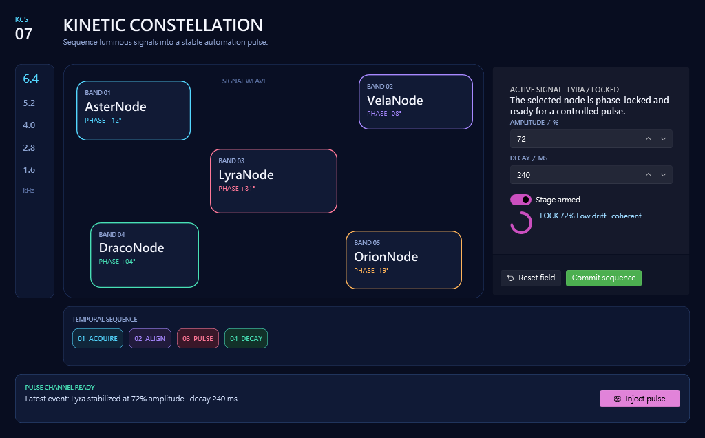

# Building a Kinetic Constellation with WPF DevTools MCP beta.75

I used the public `v1.0.0-beta.75` prerelease as a real independent Agent: public install, original UI composition, guarded project integration, WPF build, live process inspection, reversible interaction, screenshot recovery, and full uninstall. The run passed at **9.6/10**.

> Maintainer follow-up: an independent review upheld the 9.5/10 release-quality threshold. The two actionable product P3 findings—uneven pack-owned descriptions and missing restore/build guidance—were addressed for beta.76. A generic repeated-layout builder was deliberately deferred as YAGNI, and binary resource export remains a client-side concern.

## The journey

The installer was my first pleasant surprise. Its JSON gave me the release asset, exact executable, client-registration artifact, checksum policy, expected and actual digest, server command, and Composer policy profile. I did not need to clone the repository or infer where a packaged sidecar lived. The x64 archive matched GitHub's SHA-256, and exact-root uninstall later removed precisely the validation installation.

Before looking at a recipe or prior application, I wrote three materially different briefs. Abstract ledger comparison eliminated a coastal sample notebook and a shadow theatre because they were too close to earlier fingerprints. I selected a Kinetic Constellation Sequencer: a broad node field, slim frequency spine, local inspector, temporal strip, and pulse status rail.

Recipe-free compact discovery helped without dictating the design. It exposed 24 composable blocks from the core and WPF UI packs. I kept the selected topology, used grid/border/stack primitives for the signal field, and placed themed numeric, toggle, progress, button, icon, and card controls in the inspector. I deliberately did not use the available navigation, tabs, or dashboard recipe.

## How the puzzle workflow felt

The best part was stable aliasing. Editing `@InspectorHeader.properties.text` and composing into `@SignalInspector.slots.actions` felt surgical. Each immutable response told me the exact resolved path. The composed button arrived with its configured text, appearance, width, and margin already present, and the inserted-node summary proved that without echoing the whole blueprint.

Composition skeletons were also valuable. They made slot names explicit and prevented kind transcription mistakes. The slot summary reported existing/resulting counts and explicit null capacity members for the unbounded WPF UI card actions slot.

The awkward part was volume. An asymmetric pseudo-canvas made from grids and bordered stacks is a lot of nested JSON. The available blocks were capable, but a small builder operation for repeated layout patterns would reduce Agent bookkeeping while preserving creative control.

I expanded the card recipe as an independent contract check, then left it unused. That was the right outcome: recipes behaved like optional accelerators, not mandatory product shapes.

## Preview and visual confidence

The first preview compiled and loaded, and its semantic scene was complete, but runtime layout inspection found five clipping risks in my inspector. I liked that the response did not merely say “loaded”; it correlated and inspected 94/94 targets and explained exactly which nested stack exceeded its space.

I made one revision: slightly wider inspector, smaller card padding, tighter vertical spacing. The next two previews used the same immutable draft with equivalent omitted and explicit 1024 bounds. They returned the same complete 1024×636 image, zero clipping, 94/94 inspection, and no unresolved or uninspected correlations.

Visually, the result felt intentional rather than generated from default controls. The cyan, violet, coral, mint, and amber signal states read clearly over the dark indigo field. The inspector is dense but readable. The final 1320×820 app had no classic white surface, clipped copy, overlap, missing region, or theme workaround.

## Apply and build trust

The write path earned trust through refusal. Non-dry-run apply required explicit confirmation. Project integration detected central package management inherited from outside the scratch root and stopped with a complete scratch-local recovery document. After I created that local opt-out, the server produced a ready plan with one exact hash and atomic package, resource/startup, and code-behind operations.

I made one harness mistake: I built with `--no-restore` immediately after adding packages. The build could not resolve the WPF UI XAML namespace. A separate restore followed by build passed with zero warnings and zero errors. A short post-integration reminder would make this sequence harder to misuse.

## Live runtime evidence

The generated executable launched with one visible main window. `connect()` attached to the exact allowlisted process through raw injection. The scene contained 69 semantic nodes, and all 27 authored names were present. The WPF UI NumberBox's background came from an implicit style and Application theme brush—not a local harness fix.

I changed amplitude 72→81, observed one exact state diff, and restored it to 72. I used the bounded wait-after-mutation workflow to switch the armed toggle off in 19 ms and restored it to on. Clicking Inject pulse produced Click events at the button and window bubble levels. Binding and validation scans stayed clean.

## Screenshot and contract recovery

The final screenshot was resource-backed, 1320×820, 87,037 bytes, and matched its advertised SHA-256 after reconstruction. The client truncated direct large resources, so I used the server's chunk URIs. The same portable text-chunk design reconstructed the response, tools, and examples contracts without client base64, `TextDecoder`, or crypto APIs.

This recovery design was reliable, but saving many small screenshot chunks was the most mechanical part of the run. A client-side MCP resource export helper would remove substantial Agent work without weakening evidence integrity.

## Friction and surprises

Product-side friction was limited to deep nested authoring and one legitimate preview layout revision. Harness/client friction included a stale `--no-restore` build, obsolete `find_elements` arguments, a missing event name, a two-second trace window that expired before retrieval, direct-resource truncation, and a process-stop verification race. Every failure had a bounded recovery path, and none left application state dirty.

The strongest surprise was how well the contracts balanced compactness and proof. Draft refs prevented payload churn; text chunks made large contracts portable; correlation counts made “no clipping” meaningful; snapshot/restore made runtime mutation safe; and plan hashes made project writes reviewable.

## What I would improve first

1. Add a compact repeated-layout builder while keeping exact paths and immutable drafts.
2. Extend rich pack-owned property/slot descriptions to more WPF UI blocks.
3. Add client-side MCP resource export for binary evidence.
4. Add a restore reminder after package integration.

## Reflection

I came away trusting beta.75 because it exposed uncertainty rather than smoothing it over. It told me when direct resources were too large, when a preview correlation was complete, when a layout was clipped, when a draft candidate was invalid, when a write needed confirmation, and when a mutation needed restoration. At the same time, it left enough compositional freedom to build a recognizable, original instrument instead of a gallery-shaped dashboard. That combination—creative latitude with explicit safety boundaries—is the strongest part of the experience.
