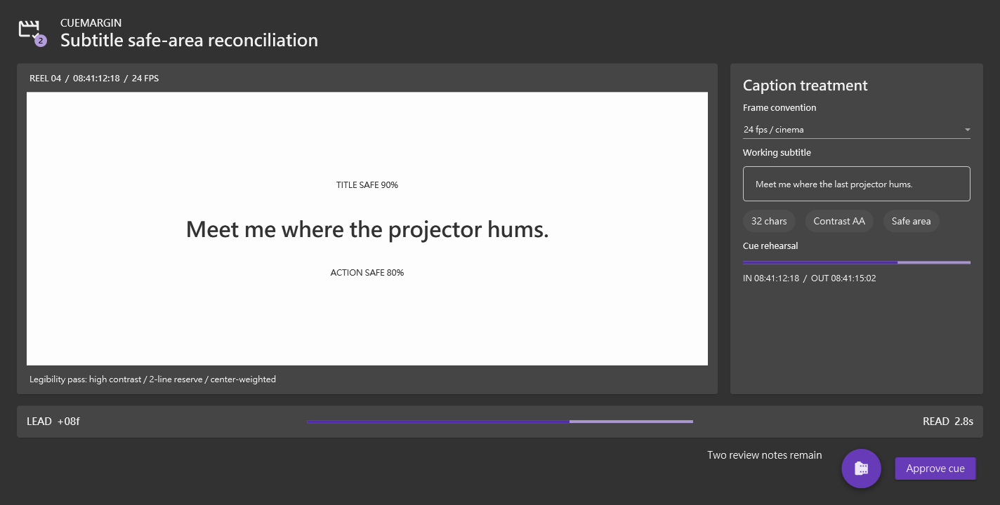

# Building CueMargin with the public beta.86 Composer and MaterialDesign pack

I approached this run as a fresh Agent with no knowledge of the independent pack-generation session and no access to prior E2E apps, reports, or screenshots. My goal was not merely to make Composer emit valid XAML. I wanted to find out whether the public prerelease and an immutable third-party pack could support a genuinely original, high-complexity WPF application that still built, launched, looked intentional, remained inspectable, and could be safely mutated and restored.

The answer was yes. The overall experience earned 9.6/10, with no unresolved project-targeted finding.

## Installation felt explicit and reversible

The public installer response immediately gave me the information I needed to establish trust: resolved beta.86 version, exact GitHub release asset, installed executable, registration artifact, trust policy, and matching expected/actual archive checksum. Because this beta uses `ReleaseChecksumOnly`, that exact checksum evidence mattered. The later exact-root `full-uninstall` mirrored installation and removed only the validation install.

I also appreciated the isolation boundary. The launcher-owned bootstrap provider existed only to expose the native tools, while I independently installed the public release into the supplied validation root. I never reinstalled, stopped, or removed the bootstrap.

## Discovery preserved creative freedom

Before reading any recipe or generation report, I imported the immutable `material@0.1.2` archive through a dry-run and hash-bound confirmation. Runtime discovery then exposed it as a project-local third-party pack alongside `core` and another built-in visual pack. I intentionally used Material as the only visual pack and core only for layout.

The compact catalog was the most creativity-friendly Composer surface I used. It gave me block identities, descriptions, categories, property names and warnings, slot bounds, renderer availability, skeletons, and roles, without expanding full property contracts or source hints. That was enough to invent three distinct briefs:

- a repertory-cinema subtitle safe-area reconciliation bench;
- an alpine snow-pit layer naming slate;
- a handbell chord-voicing rehearsal fan.

I selected the cinema concept because it fit the available surfaces and interactions while being structurally unlike the abstract diversity ledger. I named it **CueMargin**. Its dominant feature is one bright cinema picture aperture surrounded by a dark editorial treatment surface, not a dashboard, navigation shell, drawer, ledger, or repeated card matrix.

Only after choosing the concept did I query full contracts for the selected kinds. The 13,646-value icon vocabulary could have been a context trap, but substring discovery returned a bounded page of 12 `Film` matches and honest total/match/truncation metadata. I chose `FilmCheckOutline` without reconstructing the vocabulary.

## The puzzle workflow was mostly delightful

Every selected block started from its `compositionSkeleton`. I then used native grid and stack relationships to build the picture aperture, treatment well, timing ribbon, and decision notch. Immutable draft references kept the 7 KB blueprint out of repeated request payloads. Stable aliases such as `@CaptionEditor.properties.text` and `@DecisionActions.slots.children` were much easier to reason about than deep positional paths.

The workflow also recovered cleanly from my mistakes. I accidentally gave a native text block a property its contract did not declare. Composition returned an invalid but retained candidate, the exact offending path, and a slot summary. I removed only that property from the latest valid draft and repeated the insertion successfully. A deliberate missing target failed with structured guidance and did not replace the valid draft.

The transport-only probes gave me additional confidence. JSON null survived path-set as data, Merge Patch null removed an optional member, absent object parents were created, missing array traversal remained an error, atomic operations stayed ordered, and dotted or specially escaped keys produced bracket-quoted paths with copy-ready expected shapes.

## Runtime approval made preview trustworthy

The first preview compiled structurally and returned a content-bound review for the project-local Material pack. I reviewed its identity, scope, fingerprint, resources, exact package closure, and content hashes. Passing the one-call token loaded the real MaterialDesign 5.3.2 runtime without persisting trust or adding a library special case.

The approved preview was the moment the workflow became emotionally convincing rather than merely correct:

The dark root, graphite cards, outlined input, chips, purple progress, floating action, and raised approval action formed a coherent Material composition. Composer correlated and inspected all 55 targets, reported no clipping, and returned a complete screenshot. The bright picture aperture was clearly an intentional screen-within-a-screen, not an unstyled white gap.

Preview also preserved useful humility. Explicit `core.stack.spacing` values produced exact-path warnings explaining that structural and real-package measurements can differ. Stacks without the property did not receive that warning. The app therefore carried deliberate spacing decisions into the final build rather than relying on accidental preview geometry.

## Apply and integration earned trust through refusal

Apply dry-run showed the complete Window XAML, package list, resource order, file plan, binding contract, and exact 1440×759 target dimensions. The non-dry-run write required confirmation and created a backup.

Project integration initially refused to modify an inherited central package file outside the scratch root. That refusal was a strength. The response supplied a complete minimal local `Directory.Packages.props` document that disabled inherited central management for this isolated project. After I added only that advertised scratch-local file, the plan became ready. Its hash then bound exactly two operations: pinned package references and ordered App.xaml resources/startup.

Restore and Release build succeeded with zero warnings and zero errors. I launched the exact provider-allowlisted executable rather than a Debug substitute.

## The final app confirmed preview fidelity and the root-fill repair

The real Release window looked like the approved preview, with additional confidence from native dimensions and real package templates:

The Material dark root filled the entire 1424×720 client area. There was no white strip at the bottom or any other sign of the earlier root-fill defect. Runtime inspection measured the root ColorZone at the full client size with `VerticalAlignment=Stretch` and no clipping. Its nested cinema aperture remained intentionally white and bounded.

The visual hierarchy was immediately readable: brand and purpose at the top; picture content dominant on the left; frame convention and subtitle editing on the right; timing status below; final actions in the lower notch. No text or control overlapped. Purple actions and progress states were visible without overwhelming the neutral cinema surface.

Structured inspection supported the pixel judgment. Scene summary found 48 semantic nodes without truncation. Form summary found two populated inputs and six ready actions. Namescope inspection found 18 authored names. The Approve button exposed a real Material Ripple template. The outlined TextBox foreground came from an active style expression and resolved to a readable light foreground. Binding diagnostics returned zero errors.

## Mutation and recovery felt safe

I captured the subtitle text, applied one temporary runtime value, observed the exact before/after diff, restored the snapshot, and verified the original local value. I repeated the pattern with progress: a bounded mutation-and-wait changed 68 to 72 in 17 ms, produced a state diff, and restored 68.

Clicking Approve generated a bubbled Click event. The canonical event array call returned it, while a deliberately legacy scalar filter produced structured `InvalidArgument` guidance with a copy-ready array example. This combination—safe mutation, semantic diff, verified restore, and actionable negative recovery—made the runtime tools feel dependable.

## Context and pacing observations

Compact discovery and opaque drafts substantially reduced repeated context. The portable text-chunk route reconstructed the response, tools, and examples contracts with published offsets and canonical SHA metadata. A binary compatibility read also verified exact bytes and SHA.

The main remaining attention cost came from very large preview/runtime responses. The client truncated one full PNG resource, but the advertised 16 KiB chunks reconstructed its 41,323 bytes and exact SHA. The same path preserved the final 53,993-byte image. I would like an optional compact evidence-handle mode that returns only decision-critical runtime summaries plus resource handles, leaving full payloads available on demand.

Several non-product frictions were real and worth recording. `pwsh` was unavailable, so I created a minimal .NET 8 JSON validator. Windows PowerShell changed Unicode bullets in a helper script, which I caught before draft creation. One inline evidence assembly command was policy-blocked, so a short helper script replaced it. Direct web raw-file retrieval had cache/safe-URL trouble, so exact public files were saved through direct HTTP for review. None of these changed the application or hid a product defect.

## What I would improve next

My highest-value pack-neutral Composer improvement is a compact response option for preview and runtime diagnostics that returns a bounded summary plus evidence resource handles. The current chunking is correct and robust; the improvement would reduce transcript pressure, not replace evidence.

For authoring, Composer could optionally generate a short checklist from the selected skeletons: present target slots, min/max bounds, configured unfamiliar properties, and pending integration requirements. That would remove some manual bookkeeping in deep compositions while preserving Agent ownership.

The Material pack itself could add more semantic interaction examples and perhaps one intentional unbounded container if real Material use cases justify it. Those should remain ordinary pack contracts. This run strongly supports keeping Composer free of Material-specific branches.

## Concluding reflection

What surprised me most was how little the pack constrained the idea once discovery was shaped correctly. A catalog containing cards, ColorZones, inputs, chips, progress, icons, and actions could easily have pushed me toward a generic dashboard. The brief-first rule, abstract diversity ledger, compact descriptions, and skeleton-first authoring instead let me build a focused cinema tool with a distinctive spatial identity.

Trust accumulated in layers: public checksum evidence; immutable archive verification; project-local discovery; content-bound preview approval; guarded and reversible apply; hash-reviewed integration; clean Release build; matching preview and final pixels; WPF-native style and layout evidence; verified state restore; and exact-root cleanup. No single layer substituted for another.

That is why I scored the experience 9.6 rather than 10.0. The workflow is already production-grade in correctness and safety, but large evidence payloads and deep composition bookkeeping still demand more Agent attention than necessary. Even so, I finished with a real, original, visually coherent WPF application—not merely a successful schema exercise—and with enough independent evidence to trust what I saw.
