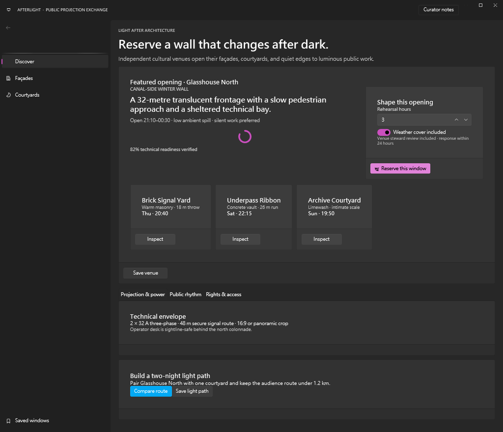

# Building Afterlight with WPF DevTools MCP beta.92

I used public prerelease `v1.0.0-beta.92` as a fresh Agent to create, build, launch, inspect, mutate, restore, and clean up a real WPF UI marketplace app. I did not inspect repository implementation source, prior E2E work, or pack-generation notes. The resulting app, **Afterlight**, is an independent public-projection venue exchange.

## Installation and first trust signal

The public installer was the first strong trust signal. It resolved the exact x64 prerelease archive, reported checksum verification against GitHub release metadata, installed into the isolated root I supplied, and later removed that root through exact-root `full-uninstall`. I did not need a local build or repository artifact.

The separate validation install and the launcher-owned native provider contained executables with the same SHA-256. That let me separate distribution validation from the provider lifecycle without guessing whether I had tested different binaries.

The installer response also made the Composer policy profile concrete. Project writes, destructive actions, and the exact project root were explicit rather than hidden in a general “unsafe mode.” I felt comfortable proceeding because each write surface remained scoped to the scratch app.

## Creative choice before recipes

The most important creative-control feature was the compact, recipe-free catalog call. It returned 24 composable blocks with descriptions, pack-qualified kinds, categories, property names and warnings, slot bounds, renderer presence, composition skeletons, and authoring roles. It did not flood the session with full contracts.

I created three candidates before looking at recipes:

- Afterlight, a public projection venue exchange organized around architectural surfaces.
- Common Thread, a textile-mending pattern and workshop market.
- Signal Garden, an ambient-light scene market with a deployment queue.

I selected Afterlight because it fit the discovered persistent NavigationView, cards, tabs, numeric/toggle controls, progress feedback, and native grid/stack layout while remaining least similar to the abstract prior fingerprints. Only afterward did I expose four recipes and expand the navigation-shell recipe as an independent contract check. I did not reuse it as my app.

This ordering preserved creative freedom. The Microsoft Store reference stayed at the level of browsing clarity and desktop-scale hierarchy; the domain, copy, topology, controls, and luminous architectural tone remained mine.

## Puzzle composition

Composer felt genuinely puzzle-like in a useful way. Every selected block supplied a skeleton. Exact slot descriptions told me what could connect, while `minItems` and `maxItems` made capacity mechanical instead of inferential.

I created one opaque immutable draft, edited `@HeroHeading.properties.text`, composed a Button into `@FeatureCard.slots.actions`, and composed one SymbolIcon into the singleton `@ReserveButton.slots.icon`. The unbounded action slot explicitly reported null maximum and remaining capacity. The icon slot reported one remaining place before insertion and zero afterward. A deliberate second icon failed with the same structured summary and did not replace the valid draft.

That was the moment I trusted the puzzle workflow: success and failure both described the same local geometry, and draft immutability removed fear from negative testing.

Transport behavior was equally disciplined. I exercised Merge Patch, quoted dotted keys, JSON null as data, exact array removal, parent creation, multi-operation atomic edits, and invalid null operations. Special keys containing quotes, brackets, and backslashes retained copy-ready bracket-quoted error paths. Recovery stayed blueprint-first.

## Focused discovery and vocabulary

Compact-then-focused discovery saved substantial attention. I requested full contracts only for the controls actually selected. The NavigationView description explained that `Left` keeps labels visible and that its pane remains persistent. The NavigationViewItem contract explained the `LeftFluent` active-label tradeoff. Slot descriptions and singleton bounds were understandable without source inspection.

The icon vocabulary was an excellent bounded-search example. The complete set contained 9,235 values, but a `Projection` query returned 12 values, disclosed 13 matches, and set the truncation flag accurately. I selected `ProjectionScreenTextSparkle20` and validation accepted it.

## Preview, surprise, and repair

The first runtime preview compiled, loaded, exposed semantic evidence, and produced real resource-backed pixels without an approval token. That was correct for this built-in pack: the public guide explicitly states that built-in runtime packs are trusted by release provenance and omitted from approval reviews.

The initial 1500×920 viewport clipped lower content. Repeating the same immutable draft at 1500×1280 reduced the structural warning to 10 DIPs and revealed almost the whole composition.

More importantly, the pixel review caught an error validation could not: my authoring helper had accidentally omitted four navigation label values, leaving the visual default `Text`. I patched those exact paths, removed three needless explicit false properties, and previewed once more at 1500×1290.

The final preview reported 83 correlated, resolved, and inspected targets, zero clipping warnings, and no inspection or warning truncation. The screenshot was coherent: readable white and secondary copy, a magenta primary state, cyan route action, clear tabs, recognizable controls, and no overlap.

This experience made preview trustworthy precisely because I did not treat structured diagnostics as a substitute for pixels. Diagnostics narrowed the issue; isolated, hash-verified pixels decided whether revision was needed.

## Guarded apply and real-package build

The first apply dry-run discovered inherited central package management outside the project root and failed closed. Its repair suggestion contained a complete minimal `Directory.Packages.props` document. I added that document only inside the scratch app, repeated the dry-run, and received a ready plan with an exact hash.

Unconfirmed XAML apply failed. Confirmed XAML apply succeeded. Unconfirmed integration failed. Confirmed integration with the reviewed plan hash succeeded. The plan added exact WPF UI packages, preserved resource order, selected startup, and aligned the generated Window code-behind base type.

The Release build then passed without an app-specific styling workaround. The exact allowlisted executable launched as a stable 1500×1290 FluentWindow.

The final app looked more polished at native resolution than the bounded preview, but it kept the same hierarchy. The persistent left pane clearly separated discovery from the venue stage. The hero copy and booking controls balanced each other. Three venue surfaces formed a readable path, the dossier remained subordinate, and the final route builder closed the page without turning it into a dashboard.

## Runtime inspection and safety

`connect()` found exactly one allowlisted visible target and recommended scene-first inspection. I followed that path: rich summary, focused searches, element snapshot, form summary, then bounded trees and template inspection.

The theme was observable rather than assumed. ReserveButton had an implicit `Wpf.Ui.Controls.Button` style. Its Background and Foreground came from template triggers; the magenta/black effective values matched the pixels. A real active BorderBrush binding resolved through a four-step value chain, and the app had zero binding errors.

For state safety, I captured WeatherCover `IsChecked`, changed True to False, observed one exact diff, and restored True with source/focus verification. I also traced a bounded ReserveButton Click, drained routed events with the canonical array vocabulary, verified no persistent state change, and restored the event snapshot. A legacy scalar event filter returned structured `InvalidArgument` guidance with copyable array examples.

That combination of mutation metadata, navigation recommendations, and explicit restore verification made runtime experimentation feel controlled.

## Screenshot handling and pacing

The screenshot contract was reliable but exposed client friction. Full resource blobs were truncated by the client. The response had already advertised <=16 KiB chunk URIs, so I read chunks sequentially, concatenated bytes, and verified exact lengths and SHA-256 values. The final preview was 80,452 bytes; the final app was 124,659 bytes. Both reopened independently and matched their advertised hashes.

The client also lacked base64-decoding and SHA APIs for the retained binary contract probe, so I marked only that compatibility path constrained. Text contract chunk reconstruction remained complete.

Pacing was otherwise good. Compact discovery and opaque drafts saved more context than the large preview/runtime diagnostics consumed. The biggest attention cost was full evidence persistence and screenshot assembly, not Composer decision-making.

## Friction and prioritized improvements

I encountered no unresolved project-targeted defect. I did encounter:

- one Agent-side JS brace parse before any MCP mutation;
- one Agent helper mistake that omitted navigation labels;
- one binding-chain retry after I reused the parent element id instead of the entry element id;
- truncated full screenshot blobs, recovered through advertised chunks;
- absent client decode/hash APIs for the binary contract probe;
- an external unauthenticated GitHub tree API rate limit while locating documentation.

My highest-value pack improvement would be richer pack-owned convenience for semantic labels in text-bearing navigation skeletons, without any Composer engine knowledge of WPF UI.

My highest-value pack-neutral Composer improvement would be an optional compact draft inspection response for a caller-selected set of exact paths after a batch patch. That could reveal omitted values before preview while keeping payloads bounded and preserving immutable-draft semantics.

I would not change the guarded apply model. The central package repair, confirmation boundaries, plan hash, and exact project scope removed much more uncertainty than they added effort.

## Conclusion

This run felt like using a constrained design system rather than filling in a canned template. Compact catalog semantics gave me enough vocabulary to choose an original concept. Skeletons and slot summaries turned layout into a comprehensible puzzle. Preview exposed both structural risk and a real authoring mistake. Guarded apply carried the reviewed result into a real package build, and runtime tools let me prove theme, visibility, interaction, binding health, and restoration.

The strongest surprise was how well creative freedom survived strict safety. I could make a distinctive architectural marketplace while every pack, slot, file, policy, screenshot, mutation, and cleanup boundary remained inspectable. At 9.6/10, beta.92 met the publication threshold without rounding and earned my trust for this real-case path.
