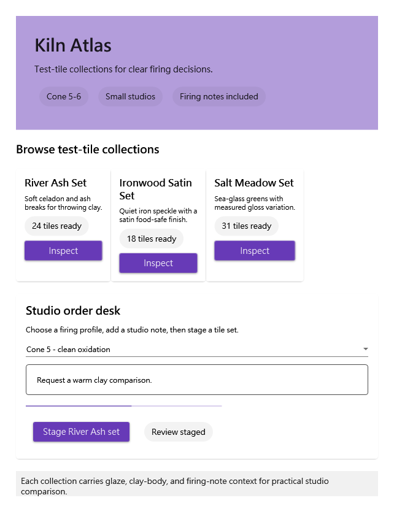

# Material Store beta.98: same-Agent experience rerun

I installed the public `v1.0.0-beta.98` prerelease into an isolated root, imported the immutable Material 0.1.2 pack through Composer, and made the small WPF marketplace **Kiln Atlas**. This was a real Composer-to-Release-to-MCP journey, not a source-level review: I built the generated `ComposerGeneratedApp` in Release, launched its exact executable, connected through the installed server, and left the install root clean after public full-uninstall.

## What felt good

The first pleasant surprise was the quality of runtime catalog information. I could start compactly, compare three distinct marketplace concepts without borrowing a prior app, then ask for just the Material blocks, slot boundaries, resource variants, and a focused icon vocabulary needed for Kiln Atlas. The result felt more like arranging a careful display system than guessing at raw XAML. The Material card, chips, buttons, text field, combo box, progress control, and layout primitives expressed a clear product story: compare three firing test-tile collections, choose a firing profile, leave a studio note, and stage a set.

Composer's immutable drafts were especially confidence-building. A first helper draft had empty optional identities, dotted names, and a numeric thickness; the structured errors named the exact paths and let me repair the candidate without losing the original. I also deliberately used isolated drafts for transport and validation probes. Merge Patch null, bracket-quoted dot keys, array removals, absent paths, ordered atomic operations, null-operation recovery, and special keys all produced compact, machine-readable outcomes. The collision regression was similarly clear: `wpfui.fluentWindow` gave a non-blocking `GeneratedClassMemberNameCollision` for the default class-derived name, the alternate XAML target removed it, and repair correctly proposed nothing.

The visual loop earned trust because it changed a real decision. The first narrow runtime image showed clipping. I made a minimal responsive Composer revision rather than replacing the concept, reran approved preview and final app capture, reconstructed both PNGs only through `resources/read` chunks, checked their length and SHA-256, and inspected them separately. The final 642x825 image shows all three offerings, the order desk, status, and footer without an empty or black region. That made the preview feel like actual evidence rather than a decorative compiler artifact.

## Runtime safety and recovery

The installed MCP server gave a crisp scene-first start: a summary identified the catalog cards, the firing-profile ComboBox, the notes field, reservation state, and footer. I captured state, changed `SelectedIndex`, observed the visible choice move from Cone 5 to Cone 6, inspected the diff, and restored it. I also traced and drained the inert River Ash action from a fresh snapshot; an empty diff was a useful truthful outcome, not a failure disguised as an interaction. A bounded no-change wait returned a safe timeout with `stateAfterTimeoutUnknown=false`. The legacy scalar event filter was rejected with an explicit array-form recovery hint. Those small negative cases made the contract feel safer than a permissive API that silently accepts malformed input.

Contract evidence was equally practical. Text contracts were reconstructed sequentially, and I independently rebuilt the `tool-examples` binary resource in 16 chunks of 768 raw bytes. Its 11,613-byte length and SHA-256 matched the advertised canonical values before JSON parsing. The documented chunk workflow is workable with a small evidence helper; a direct client-side file handoff would still remove friction.

## Friction and improvements

The main friction was procedural, not a demonstrated product fault. My first authoring helper had invalid optional fields, and a PowerShell pipeline did not persist one installer object because host-stream status did not flow through `ConvertTo-Json`. Both were recovered and are recorded as Agent-side evidence issues. The first visual pass also exposed a genuine layout problem, which Composer plus MCP pixels made straightforward to fix. Public installation, Release build, connection, pack import, and public cleanup all ultimately behaved predictably.

The smallest high-value improvement would be a concise pre-compose authored-node lint that flags empty optional names and known property-type mismatches before a full composition request. A second useful improvement would be a client-supported resource-to-file handoff carrying length and SHA-256, so an agent can persist large MCP image resources without base64/chunk plumbing while retaining the same integrity guarantees.

## Reflection and concluding judgment

I began cautious because this was a prerelease and because the creative work had to remain genuinely independent of prior examples. By the end, my confidence rose substantially: the package installed from the public channel, Composer preserved repairable drafts, preview caught a real visual issue, the Release binary was inspectable through the policy-bound runtime, and runtime mutations were reversible. I enjoyed that the store reference constrained the product goal without flattening the creative choice; Kiln Atlas still felt like a small, coherent studio tool rather than a template.

The rerun closed the remaining collision, JSON-shape, event, and transport branches before cleanup. The final experience score is **9.6/10**: strong discovery, authoring, preview/apply/build reliability, visual evidence, runtime safety, and recovery, with a modest deduction for the Agent-side retries and repeated continuation pacing. I would trust this workflow for an evidence-led WPF Composer task, while still preferring the two small ergonomics improvements above.
