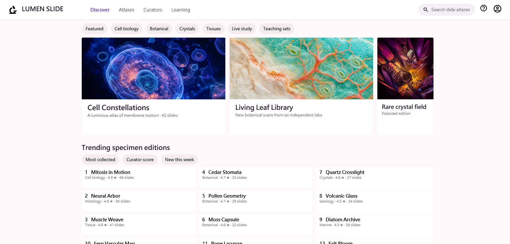

# Material Store Reference E2E Feedback — v1.0.0-beta.114

## Outcome

The public beta.114 journey passed end to end using the immutable project-local `material` 0.1.2 pack. I independently installed and qualified the public server, built an original Composer blueprint through the draft transport, previewed it with a content-bound pack approval, applied it through the guarded project plan, built and launched the Release app, inspected it through MCP, exported the final root-window PNG, verified a visible state transition and rollback, and completed public full-uninstall.

Final screenshot receipt: 1546 x 742, 543,568 bytes, SHA-256 `e103f79b3ab14123014b9762566d354434f030eb93a3c9744b41c20ae439ac66`.

## Overall usage impression

Composer felt coherent as a pack-neutral assembly system. The best part of this run was that `material` could stay responsible for its visual controls while `core` supplied ordinary layout, text, border, and project-owned image primitives. Nothing in the engine needed to know that the reference was a marketplace or that the chosen subject was microscopy.

Compact discovery was genuinely useful. It gave enough information to choose plausible block families, then focused calls supplied the exact properties, enums, warnings, slot contracts, and icon candidates. This avoided loading the very large Material icon vocabulary and kept the design process centered on the few controls the app actually needed.

The immutable draft workflow also worked well:

- create once from a validated source document;
- patch by stable alias;
- revalidate;
- repair explicit contrast warnings;
- compose a pack icon into a discovered slot;
- validate the derived draft before render and apply.

The opaque refs made immutability obvious, and the derived-draft model made recovery safer than editing a long JSON document repeatedly.

## Puzzle/slot workflow assessment

The puzzle-like workflow became convenient once the slot vocabulary was visible. `@UtilityBar.slots.children` was easy to reason about, the response reported existing/result counts, and the composed Account icon appeared correctly in the final namescope. Wildcard content slots on Material cards were useful because they allowed original image/text arrangements without pack-specific Composer logic.

The weakest part was not slot mechanics but discovery continuity. A user can understand a block contract and still need to infer which of several icon names will validate. Focused vocabulary queries solved that, but a shortlist aligned to common semantic roles—search, help, account, navigation—would reduce trial selection while remaining entirely pack-authored.

## Preview versus the applied app

Preview accurately predicted:

- global header proportions;
- seven-chip fit;
- 42/42/16 media-rail rhythm;
- the intentional trailing continuation;
- ranking-control placement;
- bottom inventory pressure and continuation.

It did not resolve the project's three `pack://application:,,,/Assets/...` images inside the isolated host. The response warned about that clearly, so I did not mistake blank preview media for final fidelity. After apply/integration, all three images loaded in the real Release app.

The content-bound runtime approval design was strong. The first preview produced a token bound to the immutable pack content; the second call consumed it exactly once. No global trust setting or mutable allowlist was necessary.

## Runtime inspection and recovery

Scene-first inspection was fast and complete: 68 semantic nodes from 444 traversed nodes with no truncation. It exposed the entire user-facing hierarchy without requiring a broad tree dump. Namescope discovery then provided stable IDs for `SearchPrompt`, `PromoRail`, `FeaturedCard`, and `RankedInventory`.

The state workflow was particularly good:

1. capture `SearchPrompt.Text` and focus;
2. perform a serialized visible mutation;
3. wait for the expected value;
4. inspect the focused DP value;
5. diff the snapshot;
6. restore;
7. verify the baseline.

The wait completed in 22 ms and the diff reported exactly one change. Restore verified both the original value and focus with no skipped state. A negative property request returned `PropertyNotFound` and a concise recovery hint instead of a transport-level failure.

The parallel read-only group also behaved predictably: zero binding errors, 393 visuals, and warmed high-confidence render statistics. A focused read afterward confirmed the session stayed healthy.

## Visual result and reference fidelity

The final app preserved the broad reference traits without copying content:

- horizontal desktop orientation;
- sparse full-width identity/navigation/utilities;
- seven secondary browse pills;
- media-dominant rail at 69.1% of the client width;
- two complete promos and one visible continuation;
- three aligned ranking columns;
- 1/4/7 then 2/5/8 scan order;
- dense content continuing beneath the viewport.

All media, copy, domain choices, palette, and identity are original. The microscopy imagery gave the app its own visual character while still exercising the reference's image-led proportions.

The remaining visual differences are small and intentional: the brand mark is monochrome, ranked entries use metadata cards without individual square thumbnails, and ranking begins slightly earlier vertically. The largest normalized anchor-edge delta was 0.070, the final client ratio delta was 3.85%, and complete entity count was 112.5% of the reference.

## Friction from several angles

### Pack metadata

`list_ui_block_packs` showed `readinessValid=false`, while the assigned immutable semantic-seed readiness report parsed as `valid=true` with 16 blocks, 16 renderers, one recipe, one example, and no errors or warnings. This did not block any workflow, but the two signals can make an Agent wonder whether the project-local import is incomplete.

The pack should bundle the relevant readiness receipt or advertise the external receipt in a way runtime discovery can recognize. That is a pack packaging improvement, not a Composer special case.

### Composer product

The screenshot resource response correctly advertised exact chunking. The most useful small improvement would be a compact copy-ready example in the response itself:

`wpf://screenshots/{id}/chunks/{offset}/{length}`

The contract already contains this information, but a directly consumable example would prevent clients from trying query-style URIs or misreading a JSON-string resource wrapper.

### Preview

Project-owned WPF Resource images are a common Composer use case. If the isolated host cannot resolve them, consider optionally staging reviewed project resources into the preview project after the same project-root and content checks used by integration. If that is intentionally out of scope, the current warning should remain prominent and include a one-line “final applied app required” status.

### Agent authoring

The run included several self-inflicted, non-product issues:

- four missing braces in the first long blueprint JSON;
- an initially non-strict PowerShell parse check;
- a wrong screenshot resource URI form and duplicate reads;
- a scratch-root filename listing that should have been avoided.

Composer's validation and the explicit screenshot contract made each recoverable. None indicates a product defect, but they reinforce the value of short, copy-ready contracts and validating a source draft before transport.

### External environment

Pillow was not installed, and the first inline `System.Drawing` compile omitted an explicit assembly reference. A referenced `System.Drawing.dll` fallback completed the numeric empty-space comparison. This was unrelated to WPF DevTools.

## Suggested improvements

1. **Pack-authored readiness linkage:** let project-local packs carry a small signed/hashed pointer to their validated semantic readiness receipt.
2. **Screenshot export example:** include one exact chunk URI plus assembly pseudocode in the file-mode response.
3. **Focused icon-role hints:** allow pack metadata to label a few common icon roles without shrinking the authoritative vocabulary.
4. **Project-resource preview option:** securely stage reviewed Resource images into isolated preview, or explicitly classify the preview as structural for those nodes.
5. **Alias map persistence summary:** after each draft derivation, return a small changed-alias summary so long patch chains are easier to audit.

All of these remain pack-neutral. None requires Composer to understand Material, marketplaces, or the reference image.

## Closing thoughts

This beta feels substantially closer to a dependable public authoring workflow than a collection of isolated tools. Installation trust, contract discovery, immutable draft derivation, content-bound preview approval, guarded integration, and live rollback form a sensible safety chain.

The strongest proof was the gap between isolated preview and the actual Release app: the product surfaced the limitation rather than hiding it, the integration plan added the correct WPF Resources, and the final MCP screenshot proved the real result. That sequence gave me enough confidence to score final visual quality 9.64, reference-informed fidelity 9.62, and overall Agent experience 9.66.
