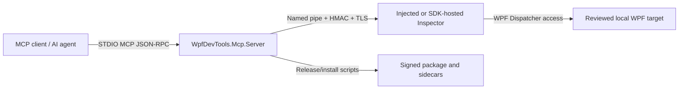
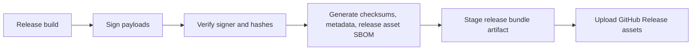

# Threat Model

This page summarizes the production threat model for WPF DevTools MCP. It is intentionally concise so external reviewers can map risks to the implemented controls and remaining assumptions.

## Security boundary

WPF DevTools MCP is a local debugging tool. The supported trust boundary is a single Windows user running a reviewed MCP server against reviewed local WPF targets. The server must treat the MCP client as untrusted input, even when the client is a trusted desktop app, because prompts, tool descriptions, and model context can be prompt-injected.

Server-side policy gates are the security decisions. Client guidance, tool annotations, examples, and prompts are usability hints only.

## Architecture diagram

## Trust-boundary table

| Boundary | Trusted side | Untrusted side | Control |
| --- | --- | --- | --- |
| MCP STDIO | Server typed request filters | MCP client prompts, tool calls, and raw JSON-RPC envelope | SDK envelope parsing; server-side tool gates after parsing. |
| Target selection | Reviewed exact local executable paths | Discovered process metadata and denied targets | `WPFDEVTOOLS_MCP_ALLOWED_TARGETS`, redaction before disclosure. |
| Inspector IPC | Authenticated server and inspector | Same-user local pipe impersonators | HMAC, TLS thumbprint pinning, PID and compatibility checks. |
| Raw injection | Signed local payloads and allowlisted target | Wrong architecture, stale PID, replaced payload paths | Architecture preflight, path validation, signature/integrity checks. |
| Release chain | Signed artifacts and generated sidecars | Modified archive, stale SBOM, missing checksum | signer trust, hash sidecars, release asset inventory, staged upload parity tests. |

## Data-flow table

| Flow | Sensitive data | Primary limits |
| --- | --- | --- |
| `connect()` / `get_processes` | process names, executable identity, window titles | target allowlist, redacted denied counts, exact local paths only. |
| scene and binding reads | UI text, DependencyProperty values, binding data | sensitive-read gate, output caps, compact response modes. |
| screenshots | target pixels and retained PNG files | screenshot gate, metadata/file mode default, server-owned resource root, retention window. |
| mutation tools | live UI and ViewModel state changes | destructive gate, snapshot/diff/restore workflow, structured cleanup fields. |
| release publishing | package archives, checksums, signer metadata, release asset SBOM | trusted signer policy, sidecar parity, staged artifact upload checks. |

## Attacker capability matrix

| Attacker | Assumed capability | Not assumed |
| --- | --- | --- |
| Prompt-injected MCP client | Can call registered tools and request misleading workflows. | Cannot bypass server-side gates or target allowlists. |
| Same-user local process | Can inspect user-writable files and race local processes. | Cannot bypass HMAC/TLS/PID checks without matching secrets and target identity. |
| Malicious target process | Can present misleading UI/runtime data and host an incompatible SDK pipe. | Cannot become allowlisted without exact target policy configuration. |
| Release tamperer | Can modify unsigned local copies or omit artifacts before publication. | Cannot produce trusted signer metadata or matching generated sidecars without release credentials. |

## Release-chain diagram

## Accepted-risk register

### Same-user code remains inside the local trust boundary

- Status: Accepted with controls.
- Owner: Release owner.
- Accepted date: 2026-06-01.
- Revisit date: 2026-09-01.
- Rationale: This is a local debugger. DPAPI, ACLs, HMAC/TLS, and redaction reduce accidental exposure, but they do not defend against fully compromised same-user code.

### Raw injection remains an emergency path

- Status: Accepted with opt-in.
- Owner: Release owner.
- Accepted date: 2026-06-01.
- Revisit date: 2026-09-01.
- Rationale: Some WPF targets cannot host the SDK. Raw injection requires exact target allowlists, matched architecture, and trusted local payloads.

### STDIO is single-session only

- Status: Accepted until transport redesign.
- Owner: Release owner.
- Accepted date: 2026-06-01.
- Revisit date: 2026-09-01.
- Rationale: HTTP/SSE or multi-client transport requires explicit session isolation work before production use.

## Security contact

Report a suspected vulnerability by opening a private GitHub Security Advisory for the repository owner. Include affected version, commit SHA, reproduction steps, and whether a public release artifact is involved. Do not publish exploit details, screenshots, target UI data, certificate material, or auth secrets in public issues before a maintainer has triaged the report.

## Threats and Mitigations

### MCP client as untrusted or prompt-injected caller

- Risk: A client may request sensitive reads, screenshots, mutations, or process discovery outside the user's intent.
- Mitigations: Target allowlists, sensitive-read gates, screenshot gates, destructive-tool policy gates, structured error contracts, and server-side validation before process metadata disclosure.

### same-user local attacker

- Risk: Code running as the same Windows user may inspect local files, environment variables, pipes, or process state.
- Mitigations: Local-only path validation, DPAPI-protected default secrets, protected ACLs for persisted auth/cert files, named-pipe authentication, TLS certificate pinning, and redacted default logs.

### malicious target process

- Risk: A target may expose misleading UI state, attempt to exhaust diagnostic payloads, or host an incompatible SDK pipe.
- Mitigations: Exact target allowlists, runtime compatibility checks, output caps, timeout handling, secure transport validation, and fail-closed SDK transport configuration.

### fake named-pipe / MITM server

- Risk: A local process may impersonate an Inspector pipe to capture commands or spoof responses.
- Mitigations: Process-derived pipe names, HMAC challenge-response, TLS certificate validation, host compatibility ping, PID validation, and adversarial fake-pipe regression tests.

### raw injection risk

- Risk: DLL injection can fail, target the wrong process, or cross architecture/security boundaries.
- Mitigations: Exact injection allowlists, architecture preflight before `OpenProcess`, trusted local payload path validation, release signature/integrity checks, and SDK-hosted mode as the preferred path when the target app can opt in.

### screenshot, ViewModel, and runtime data exfiltration

- Risk: UI text, screenshots, binding values, ViewModel data, and state snapshots can contain secrets.
- Mitigations: `WPFDEVTOOLS_MCP_ALLOW_SENSITIVE_READS`, `WPFDEVTOOLS_MCP_ALLOW_SCREENSHOTS`, compact text fallback, omitted base64/log text fallback fields, local path redaction, and resource retention limits.

### supply-chain and release tampering

- Risk: A modified package or installer could register a malicious MCP server.
- Mitigations: Signed payload verification, package hash sidecars, canonical release metadata, SBOM sidecars, package-local integrity checks, and residue checks after uninstall.

### unsupported future HTTP/SSE multi-session transport

- Risk: Static process-wide caches and STDIO session assumptions could leak state across clients if reused for multi-session transport.
- Mitigations: Current production support is STDIO single-session. HTTP/SSE must not be enabled until session-specific state is moved into DI/request/session scope and covered by isolation tests.

## Out of scope

- Protecting against an administrator or malware already running with higher privileges than the MCP server.
- Making raw injection safe for arbitrary unreviewed targets.
- Supporting Native AOT or self-contained single-file injection.
- Treating screenshots, ViewModel values, binding values, or state snapshots as non-sensitive.
- Treating future HTTP/SSE transport as production-ready before explicit multi-session isolation work is complete.

## Review checklist

- Confirm `WPFDEVTOOLS_MCP_ALLOWED_TARGETS` and `WPFDEVTOOLS_INJECTION_ALLOWED_TARGETS` contain exact reviewed local executable paths.
- Keep sensitive reads, screenshots, and destructive tools disabled unless the current diagnostic session requires them.
- Prefer SDK-hosted Inspector for apps that can opt in; use raw injection only for reviewed targets and matched architecture.
- Use file or metadata screenshot output for normal diagnostics; avoid inline base64 unless the payload is intentionally small.
- Verify release archives, checksums, signer metadata, and SBOM sidecars before publishing or installing production packages.
