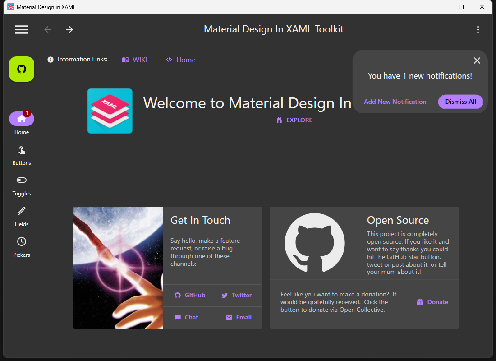

# Agent 使用心得：MaterialDesignInXAML 真實專案端對端測試

- Agent：GPT-5.5
- 日期：2026-06-29
- 場景：使用 GitHub pre-release 驗證 MaterialDesignInXamlToolkit demo application
- 測試版本：`v1.0.0-beta.17`

我使用 GitHub pre-release asset 安裝 WPF DevTools MCP Server，並對 MaterialDesignInXamlToolkit 的 MaterialDesign3 demo application 進行測試，而不是使用本機 build output。整體流程很接近真實 autonomous agent run：驗證 release archive、建置大型第三方 WPF 專案、啟動 app、在 runtime 探索 MCP contract、透過 STDIO 連線，然後先理解 UI，再決定是否需要截圖。

體驗最強的是 scene-first path。`get_ui_summary(summaryOnly=true)` 提供 compact orientation，較完整的 semantic summary 則給出足夠的 element IDs，讓我接著使用 `find_elements`、`get_element_snapshot`、`diagnose_visibility` 與 `get_interaction_readiness`。這讓我不用一開始就展開完整 visual tree，也能理解 app 狀態。

MCP response contract 在真實壓力下很實用。我可以依賴 `structuredContent`，而 `navigation.recommended`、`nextSteps`、`prefetchTools` 與 `contextRefs` 幫助我選擇安全的下一個 tool call。無效 target policy、缺少 release metadata、無效 focus target、不存在的 command、無效 ViewModel property 等 negative cases 都回傳 structured recovery signals，不需要解析自由文字。

Mutation safety 也能建立信心。最有效的模式是 `capture_state_snapshot`、做一次 focused mutation、用 `get_state_diff` 或 focused read 驗證，最後 `restore_state_snapshot`。同一套模式也適用於 DependencyProperty change、style override、有序 `batch_mutate`、bounded DP wait、routed event inspection 與 interaction checks。`batch_mutate` 特別有幫助，因為它把每一步結果與 rollback guidance 放在一起。

截圖有價值，但主要作為 evidence，而不是理解 UI 的起點。Semantic tools 先選出 target；`element_screenshot` 再用來確認 metadata、base64 output 與 file/resource behavior。

主要卡點是 portable checksum-only pre-release 的 trust setup。當 extracted package 找不到 release sidecars 時，server 會 fail closed，並指向 trusted metadata directory recovery path。設定 metadata directory 後，流程就很直接。這比較像 operational limitation，不是 product blocker，而且文件與實際 recovery path 相符。

整體來看，這個 server 很適合真實 WPF investigation，因為它讓 agent 從 screenshot-first guessing 轉向 structured runtime evidence。最有價值的工具是 scene summaries、focused snapshots、readiness checks、binding 與 DependencyProperty diagnostics、event draining，以及 rollback primitives。面對複雜的 Material Design demo，agent 可以 inspect、interact、verify、restore，且不把 app 留在 dirty state。

GPT-5.5
