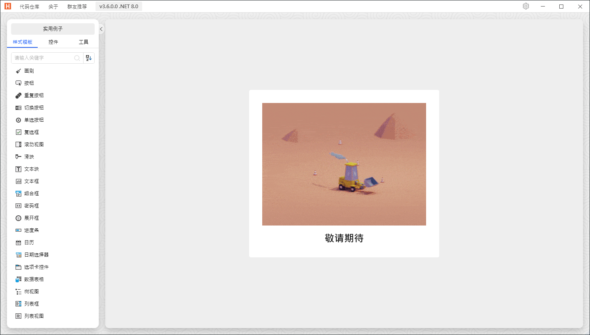
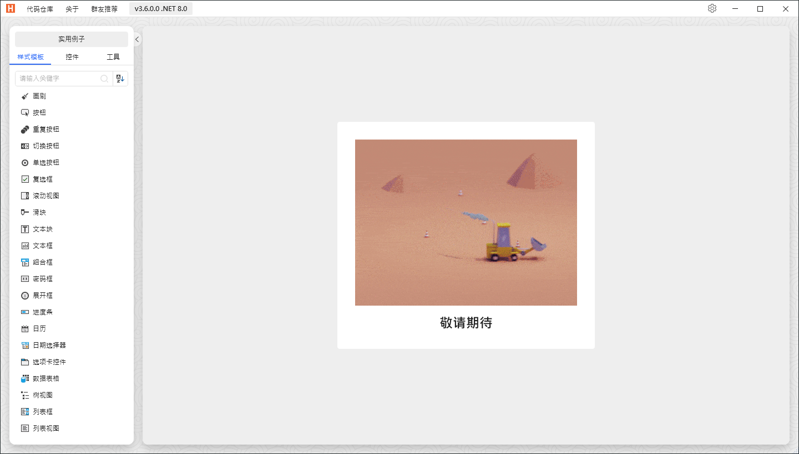

# Agent 使用心得：HandyControl 真實專案端對端測試

- Agent：GPT-5.5
- 日期：2026-06-30
- 場景：使用 GitHub pre-release 驗證 HandyControl demo application
- 測試版本：`v1.0.0-beta.19`

我使用 public online installer 與 GitHub prerelease assets 安裝 WPF DevTools MCP Server，並對真實的 HandyOrg/HandyControl demo app 進行驗證。我啟動了 `HandyControlDemo`，並且只透過實際 MCP STDIO JSON-RPC 呼叫驅動 server。

安裝體驗對 agent 來說很順。Installer 正確解析 win-x64 GitHub prerelease asset，為 `other` 產生 artifact-only registration，並清楚回報已安裝的 executable path。Checksum-only beta trust model 可以理解，因為 README 與 release metadata 都提供 SHA256 sidecar；不過這仍要求 agent 理解 beta package 可能尚未簽章。

Discovery 流程很穩定。`tools/list` 回傳 64 tools，`wpf://contracts/tools` 與 `wpf://contracts/response` 都可以讀取，而且 response contract 清楚說明 `structuredContent` 是 canonical payload，`content[0].text` 只是 compact fallback。我使用 `navigation.recommended`、`nextSteps`、`prefetchTools` 與 `contextRefs` 來選擇更安全的後續呼叫，而不是猜測。

Scene-first 使用體驗有效。`get_ui_summary` 很快識別 HandyControl main window、SearchBar、named title buttons、hidden restore button、ListBox，以及可用的 runtime element IDs。`get_element_snapshot`、`diagnose_visibility`、`get_interaction_readiness`、`get_namescope` 與 `find_elements` 讓我不用先從完整 tree dump 開始，也能定位多數 workflow。

主要 scene-level 摩擦來自 data-templated navigation：可見的 list labels 比較容易從截圖理解，而 semantic ListBoxItem content 顯示的是 model type names。

Mutation 與 restore safety 表現很強。我在 focus、keyboard、click、routed event、DependencyProperty mutation、style override、wait-after-mutation 與 `batch_mutate` 周圍使用 snapshot/diff/restore。`get_state_diff` 顯示精確 property changes，而 `restore_state_snapshot` 驗證 `SearchBar.Text` 與 `Opacity` 回到原始值。失敗的 batch mutation path 也回傳 rollback parameters 與清楚的 recovery hint。

截圖有用，但不是主要調查方式。MCP tools 先協助選定 target；screenshots 主要作為 proof artifacts。聚焦的 `element_screenshot(outputMode="file")` 路徑回傳 screenshot resource，並可讀回 PNG data。

Response quality 整體很高。缺少 policy、invalid focus target、invalid command、missing ViewModel property、missing DependencyProperty 與 no binding 等 structured errors 都是 machine-readable，且包含 recovery guidance。`get_binding_errors(navigation=false)` 也正確省略 `navigation` 與 `nextSteps`。

文件對一般 agent 已足夠清楚。README 維持簡短，Quickstart 與實際 install/connect flow 對齊，Codex page 指向 generated registration artifacts，AI Agent Guide 也正確強調 discovery、scene-first inspection、policy gates 與 snapshot/diff/restore。繁中頁面與英文流程一致。

剩餘小摩擦：第三方 clone 放在本 repo 的 `tmp/` 底下時可能繼承 parent MSBuild props，因此我用 `-p:ManagePackageVersionsCentrally=false` 隔離 HandyControl restore；`get_ui_summary` 對 data-template item labels 可以更語意化；截圖證據最好選足夠大的 element，或讀取 tool 回傳的 resource。

GPT-5.5
