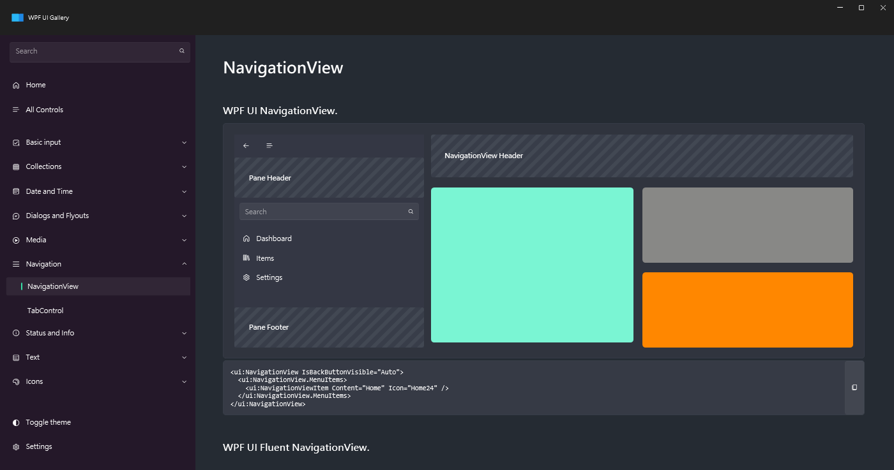

# Agent 使用心得：WPF UI Composer Public Pre-release E2E

`v1.0.0-beta.31` 的 public online installer 路徑很直接：installer 解析 GitHub pre-release asset、安裝到 scratch root，並且針對 `other` 產出 artifact-only registration。

Composer 可以透過已安裝的 MCP server 以 STDIO 正常使用。Agent 探索內建 WPF UI pack，選擇 `wpfui.shellWithNavigation`，展開並驗證 recipe，執行 preview，然後在 dry-run confirmation guard 之後套用到 scratch `dotnet new wpf` app。

產生的 app 在套用 Composer 回報的 scratch-local 設定後可以建置與啟動：包含 WPF-UI package reference、scratch-local central package version、WPF UI resource dictionaries，以及 `FluentWindow` code-behind inheritance。啟動後，runtime inspection 可針對該 app 執行 scene-first summaries、focused reads、bounded trees、screenshot capture、snapshot/restore、bounded wait 與 negative recovery call。
