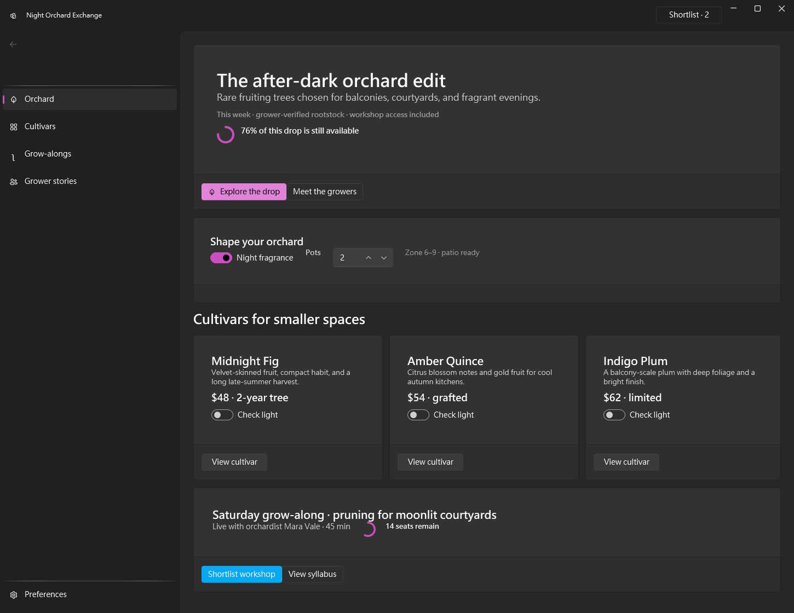

# Building Night Orchard Exchange with WPF DevTools MCP v1.0.0-beta.87

I used the public `v1.0.0-beta.87` prerelease as a sole Codex Agent to create, apply, build, launch, inspect, and safely interact with an original WPF UI application. This report describes the experience from my point of view; it is not a product walkthrough reconstructed from source.

## My journey from public package to running WPF app

I began with the public prerelease installer, not a repository build. The installer resolved the exact beta, downloaded the x64 asset, and verified the release checksum. The expected and actual SHA-256 matched. That early transparency mattered: checksum-only prerelease trust was presented honestly, while runtime correctness and cleanup still received production-level scrutiny.

I created a fresh `ComposerGeneratedApp` and gave Composer write authority only for that scratch root. Runtime discovery showed 77 tools and two built-in packs: WPF UI for the visual system and core for native layout. I did not import, copy, patch, or regenerate either pack.

Before looking at recipes, I used the compact catalog to invent three different marketplace briefs. I selected Night Orchard Exchange because it fit the available controls and was least similar to the abstract diversity ledger. The Microsoft Store reference gave me a target level of browsing hierarchy and desktop scale, but it did not dictate the domain or topology. I chose a nocturnal horticultural marketplace with persistent categories, an editorial feature, cultivar comparison, preference controls, and a grow-along workshop.

## What the puzzle workflow felt like

The block-and-slot model felt like a well-instrumented construction puzzle. Compact discovery told me what pieces existed, what each piece meant, which slots were singleton or unbounded, and which skeleton to start from. Focused reads then gave me the precise properties for only the kinds I had selected.

That division preserved my attention. One symbol property had a 9,235-value vocabulary; a capability-relevant Leaf query returned only 12 useful values while still reporting the unfiltered total, filtered match count, and truncation status. I could make a grounded selection without hauling an enormous enum into context.

Immutable draft references made experimentation comfortable. A meaningful alias edit identified the exact property path, and slot composition returned the resolved path, configured values, counts, and remaining capacity. Invalid composition did not silently corrupt the valid draft. Even a validation-invalid candidate remained available through a candidate reference.

I was surprised by how carefully generic JSON transport behaved. Dotted keys, quoted paths, null-as-data, array removal, absent object-parent creation, ordered batches, and failure atomicity all had structured outcomes. A special key containing a bracket, quote, and backslash still produced a correct bracket-quoted diagnostic path rather than a misleading flattened name.

## Where I had to reason harder

The hardest step was spatial. My marketplace was intentionally large and content-rich, and the default preview viewport clipped it. The correlation evidence made the problem measurable rather than visual guesswork. One retry at 1450×1120 resolved all 73 correlated targets, inspected all 73, and reported no truncation or clipping warnings.

The second awkward step was generated naming. A root element name that matched the generated class produced a non-blocking collision warning. An alternate target filename removed it, and repair correctly returned no action. An independent `MainWindow` preview then compiled, confirming that the temporary host itself no longer created a collision.

These were good recoveries, but they still cost Agent attention. I would like Composer to estimate desired viewport size before launching the preview and to surface the generated class/member risk earlier in draft validation.

## Preview trust and pixel evidence

At the accepted viewport, preview was a strong predictor of the real app. It loaded the WPF UI controls, found the named regions, and returned semantic plus layout evidence together with a file-backed screenshot.

I explicitly compared omitted screenshot bounds with `1024×1024` bounds on the same creative draft. Both resources reconstructed to the same 1024×791 PNG, 70,008 bytes, and the same SHA-256. One client rendering briefly showed a dark image despite the identical bytes. Reopening the exact verified resource displayed the complete marketplace. That experience reinforced an important distinction: byte-level resource evidence was stable even when the client display momentarily was not.

The preview image already showed a convincing application: dark persistent navigation, strong editorial hero, visible filter state, three comparable products, and a workshop action. The final native WPF screenshot was sharper, but it did not reveal a structural surprise.

## Apply, integration, and Release build

The transition from preview to project writes was conservative. Render and dry-run apply did not write files. The confirmed apply carried the accepted 1450×1120 dimensions to the actual Window. Project integration required the reviewed plan hash and rejected an unconfirmed call.

The scratch project inherited central package management from its environment. Composer failed closed and supplied a complete minimal opt-out document. Adding only that local file made the plan ready. The reviewed plan then applied the required WPF UI package, resource dictionaries in exact order, startup-purpose application XAML, and FluentWindow code-behind integration.

The Release build completed with zero warnings and zero errors. I launched the exact executable that the provider had allowlisted and connected through raw injection.

## Inspecting and using the final application

Native scene-first inspection matched what I saw in the pixels. The window exposed 67 semantic nodes, exact names for key regions, stable bounds, clean bindings, applied theme resources, and no root clipping. The final app did not look like classic WPF: there was no white default surface, unreadable foreground, or local style patch.

The interaction proof was small but meaningful. I captured the fragrance toggle’s state and focus, clicked it through the native WPF pipeline, observed `IsChecked` change from True to False, drained the routed Click event, compared the state, and restored True. The restore was explicit and verified. A bounded wait also timed out safely with known state.

That mutation flow increased my trust more than a screenshot alone could. It proved the generated controls were not just visually present; they were reachable and behaved like real WPF controls.

## Contract and recovery quality

I reconstructed the canonical response, tools, and examples contracts through portable text chunks, then verified one contract through binary chunks and SHA-256. The seven Composer consumers all exposed the same 65,536-character blueprint limit. Preview dimensions exposed positive ranges. Native descriptions supplied copy-ready aliases and correctly bounded compact-value guidance.

Failures were generally useful. Missing paths, bad batch items, class/member collisions, central package policy, legacy scalar event input, and bounded timeout all returned enough structure to choose the next action. I rarely had to infer whether state was safe.

The remaining friction was mostly client-side: large metadata output could truncate, resource chunks required manual assembly, built-in `atob` was unavailable, and one verified image needed to be reopened after a display glitch. A client helper that writes chunked resources directly to a SHA-verified file would remove a disproportionate amount of ceremony.

## Context, pacing, and attention

Server latency was not the bottleneck. Draft and validation calls were fast, and preview compile/load completed in seconds. The main cost was keeping a large contract surface organized while preserving evidence for every gate.

Compact catalog discovery, immutable references, exact JSON paths, and bounded summaries all helped. The canonical manifest was authoritative but large. A smaller Composer contract digest that points back to canonical hashes would improve the first ten minutes of an Agent session without weakening the formal contract.

## Documentation and cleanup

The current public documentation matched runtime discovery at 77 tools and clearly scoped custom-root uninstall and security gates. I found no documentation defect.

Cleanup was complete. The generated process is gone, the independent public validation install root is absent, and the launcher-owned bootstrap remains in place and untouched. Temporary base64 staging files were deleted. This clean ending was important: the system’s safety story held through the entire lifecycle, not only during mutation.

## What I would improve first

1. Give preview a pack-neutral desired-size estimate and smallest-sufficient-viewport hint.
2. Warn about generated class/member identity collisions before a preview cycle.
3. Add a compact Composer schema digest for draft operations, aliases, consumer limits, and preview bounds.
4. Offer verified resource-to-file streaming in clients that support filesystem evidence.
5. Let packs advertise an overflow-aware or scroll-host layout primitive for tall desktop experiences.

## Final reflection

This was a rare E2E workflow where creative freedom and safety reinforced each other. I could invent a distinctive application, use runtime-discovered pieces rather than library assumptions, recover from mistakes without losing the valid design, trust preview before writing, and prove the final WPF application through both pixels and runtime semantics.

The result earned my exact, unrounded 9.5/10. The remaining work is mostly ergonomic: reduce the attention cost of spatial sizing, naming collisions, and chunked evidence. The underlying public install, Composer model, guarded integration, WPF UI fidelity, runtime inspection, rollback, and cleanup already felt dependable enough for another serious autonomous build.
