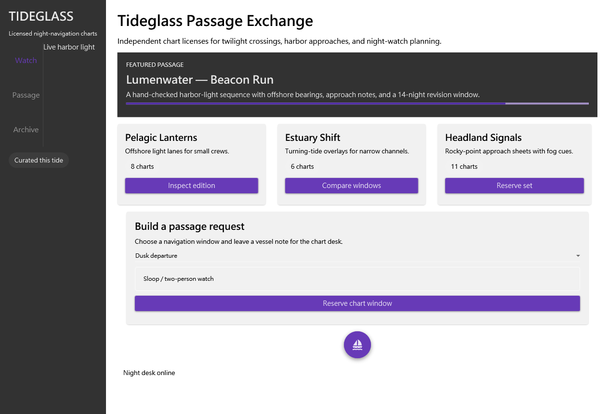

# Material Store E2E Agent Feedback — v1.0.0-beta.98

## Journey

I installed the public prerelease into the supplied isolated root, imported the immutable Material archive only through Composer's reviewed dry-run/confirmation path, and created Tideglass Passage Exchange: an original desktop marketplace for licensed night-navigation charts. The design used the assigned reference only for wide-window browseability and density. Compact catalog discovery preceded recipe access, and the selected composition used project-local Material blocks with core layout primitives.

Composer's puzzle model felt natural when following pack-owned skeletons: slots made nesting explicit, focused property contracts made the selected Material controls usable without library-specific guessing, and immutable draft references made the small revision history safe. The runtime approval flow was especially clear: the first preview identified the content-bound Material approval need, then the request-scoped token enabled the same draft without persisting trust.

Preview, guarded apply, project integration, Release build, and raw-injection runtime inspection succeeded. The first final-app pixel review exposed black copy on dark product cards. I rejected that version, made a four-property card-surface revision, rebuilt, and verified the readable final PNG. That recovery increased confidence because the final application, rather than a preview-only signal, decided the visual outcome.

## Evidence and safety

The final root window screenshot is 1264×861 pixels, 85,671 bytes, SHA-256 `e7d53683974cc9812f68ea10bdeed43d2d9d27d01104f51ecc705b079b059556`. Scene-first runtime reads found 70 semantic nodes, active Material styles, zero binding errors, zero validation errors, and unclipped target controls. A native interaction changed the route-window ComboBox selection from 0 to 1; snapshot diff proved the change and restore verified return to 0.

I also reconstructed the public response, tools, and examples contracts through their advertised text chunks; the 77-tool manifest published all seven `blueprintJson` consumers at `maxLength=65536`. The resumed 11-call read burst completed without `TransportReset` or `NotConnected`. Public README, AGENT_INSTALL, Codex quickstart, manual-install, agent guide, and workflows files were saved and reviewed from beta.98 raw responses.

## What felt strong

- The installer gave a verifiable public-release path and full-uninstall completed cleanly.
- Compact-then-focused discovery retained the third-party semantics needed for a real composition while controlling payload size.
- Pack-defined resource ordering and guarded integration kept project edits intentional.
- Preview approval, structured negative recovery, DP metadata, snapshots, and restores were precise and safe.
- Creative freedom remained intact: Tideglass has its own domain, information architecture, tone, and interaction model.

## Remaining friction and priorities

The most expensive non-product work was reconstructing resource-backed screenshot bytes into a report file. An MCP-native evidence export that preserves resource metadata and writes an approved evidence file would remove that mechanical burden. Relaunch-scoped element IDs also require a fresh exact lookup before mutation; structured `ElementNotFound` recovery worked, but a response-level reminder after reconnect would be helpful. These are workflow refinements, not unresolved project findings.

## Conclusion

I trust this release path for the demonstrated Composer workflow. It supported an original, dense desktop marketplace from pack discovery through final WPF pixels, while making review, mutation, and rollback observable. The exact Agent experience score is 9.5/10: high confidence in installation, authoring, preview/apply/build, visual fidelity, runtime inspection, recovery, and documentation, with a small remaining efficiency cost for evidence assembly and session-scoped IDs.
