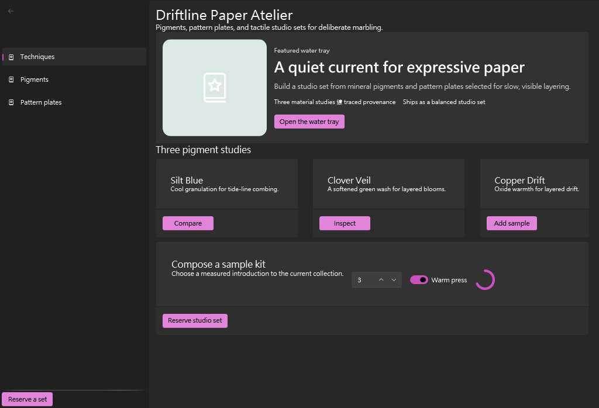
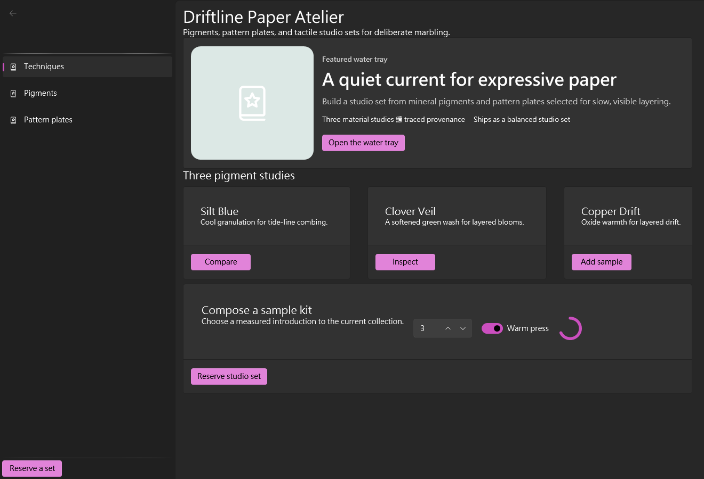

# Driftline Paper Atelier — Same-Agent E2E Feedback

I completed this public `v1.0.0-beta.97` run end to end with the installed provider, Composer, the generated Release application, and native MCP evidence. I used the WPF UI Store reference only as a desktop-density constraint. Driftline Paper Atelier is an original hand-marbled-paper marketplace: a persistent technique pane, water-tray editorial feature, three pigment studies, and a sample-kit reservation rail.

The strongest workflow detail was immutable draft references. A structured invalid-name diagnostic led directly to a safe repair while retaining the source draft, and ordered patch/compose/repair probes made the resulting authored state auditable. Preview, guarded apply, project integration, Release build, runtime connection, snapshot/diff/restore, event/wait evidence, and resource-byte image verification then formed a credible chain. Compact catalog discovery kept the puzzle workflow manageable; focused contracts supplied the exact slots, properties, examples, and recipe semantics without requiring broad catalog dumps.

The main surprises were harness-oriented rather than product defects: PowerShell serialization needed careful shape handling, draft and screenshot references were server-session scoped, a preview resource was nested in `previewHost.runtimeDiagnostics`, and checksum-only prerelease injection needed retained official release metadata. Each condition produced a recoverable structured result. I classify the repeated null-resource assumption and policy-gate recovery as Agent/harness friction, not product friction.

Post-run contract triage showed that my two tentative product suggestions were already covered: the tool description states that compact runtime diagnostics retain screenshot resource handles, and `layoutRiskSummary` supplied exact paths, overflow amounts, and pack-neutral repair guidance. No product change is justified from those observations. The puzzle composition itself was convenient after compact-to-focused discovery; the principal testing friction was correctly preserving server-session scope and reconstructing byte resources. The final visual review is **9.5/10, not rounded**: hierarchy, styling, visibility, enabled affordances, desktop density, originality, and completeness pass; all three studies and the complete sample-kit action region are visible at 1320×900 with no clipping.

The verified preview is 1024×698, 56,810 bytes, SHA-256 `5273def850befd277ccb71e07ab6015b4d03a16de03a4c72eb505dac856c837d`; the verified final is 1320×900, 66,900 bytes, SHA-256 `518bb5edec3a96b79ab8995c38cf0afe30ea6ab092159356c74c7b54c131ea1c`. External launcher telemetry recorded two context compactions, with 87.24% peak occupancy and 17.39% final occupancy after compaction. I left the workflow more confident in Composer’s creative range than I began.
