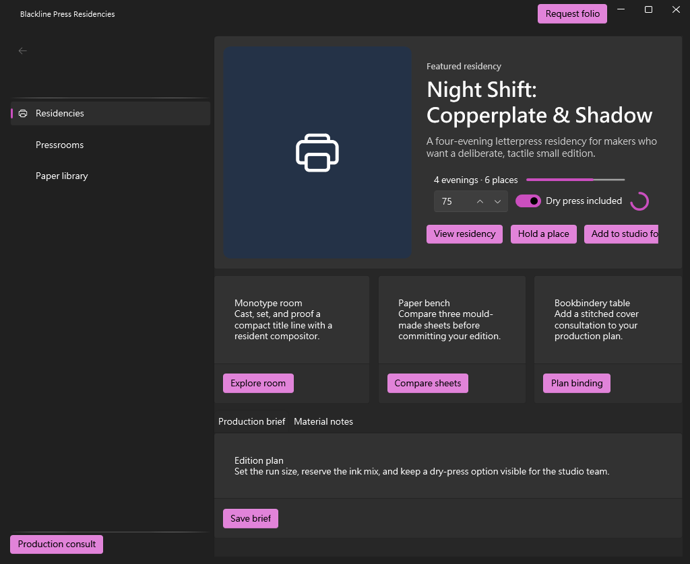
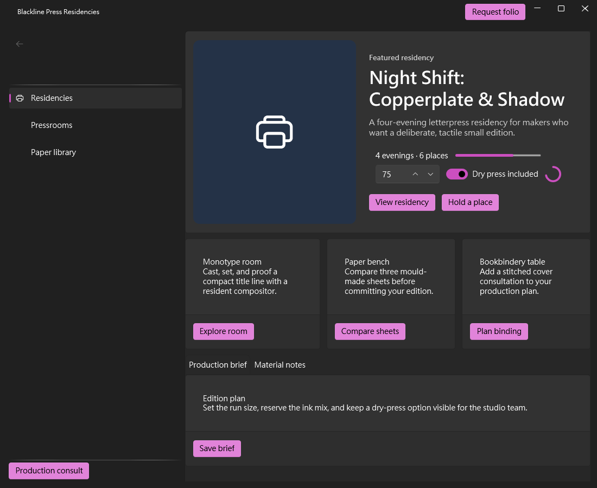

# 我的 WPF UI Store-Reference E2E 使用心得 — beta.98

我將公開 beta.98 套件安裝到乾淨的目錄，接著使用已安裝的 Composer contract，建立原創的印刷工作室市集 **Blackline Press Residencies**。對 prerelease 而言，安裝器的體驗意外地沉穩：它解析 GitHub asset、說明僅以 checksum 建立信任的模型，並產生只含必要資訊的註冊檔，不需要我猜測任何隱藏狀態。

Composer 給了我真正的創作空間。我先提出三個互不相關的市集概念，只與抽象 diversity fingerprints 比較，最後選擇印刷駐村方向。Compact catalog discovery 是建立信心的關鍵：在決定結構前，我就能看見 NavigationView 的持續行為、roles、slots、警告文字與 skeletons；focused queries 則只補上所需的 property 語意。經過篩選的 symbol 搜尋也令人驚喜：它從龐大的 vocabulary 中回傳有限且相關的一頁結果，不必讓我猜測 WPF UI enum member。

組合過程像是在完成一幅好玩的拼圖。Immutable draft references、`@ElementName` aliases、精確解析後的 paths 與 slot capacity summaries，讓每次修改都容易理解。我刻意用 hero、三個工作室、分頁簡介、導覽、輸入與回饋控制項製造 layout 壓力。第一次 preview 發現水平壓力，第二次則發現垂直內容過多。過程一度令人挫折，但 diagnostics 指向我編寫的節點並說明確切結構問題。把工作室區改成三欄 grid，再將控制項收進 hero 後，設計反而更完整，而不是被迫妥協。

Apply 與 build 流程讓人高度信任。Composer 拒絕修改上層 central package 設定，改為提供最小的 scratch-local 修復，並要求以已審查的 hash 與 confirmation 進行 integration。Release build 以零 warning、零 error 完成。實際 WPF 視窗保留 preview 的深灰色表面、藍色印刷符號、清楚的白色文字與蘭紫色操作按鈕。我尤其喜歡它看起來像完整的桌面市集，而不是只替範例 card 換上樣式。

Runtime inspection 進一步強化了信任：connection 只找到精確 allowlist 中的 executable，scene summary 顯示所有編寫的區域，連續 11 次 read 也保持連線。我在 snapshot/diff/restore 流程內實際點擊 ToggleSwitch；`IsChecked` 從 true 變成 false，restore 後也驗證回到 true。這種小而具體的安全證據，會讓我的信心從「app 成功顯示」提升為「工具能在完成後留下乾淨狀態」。

唯一明顯的節奏摩擦是 client 端截斷完整 screenshot blob。Server 公開的 16 KiB resource chunks 能精確重建兩張 PNG，因此這是 harness 限制，不是產品缺陷。兩次本機命令重試同樣只是普通的小插曲。若 preview 前能有一個小型且 pack-neutral 的 layout-pressure estimate，應可省下一輪 iteration；但我不希望這項能力限制 Composer 的創作空間。

完成後，我比開始時更有信心：安裝器透明、discovery 精簡但不含糊、authoring contract 可以復原，而且 preview、apply、build 與 runtime 證據一致。我給這次體驗 **9.6/10**，因為剩下的改善方向是效率，而不是正確性或可信度。
