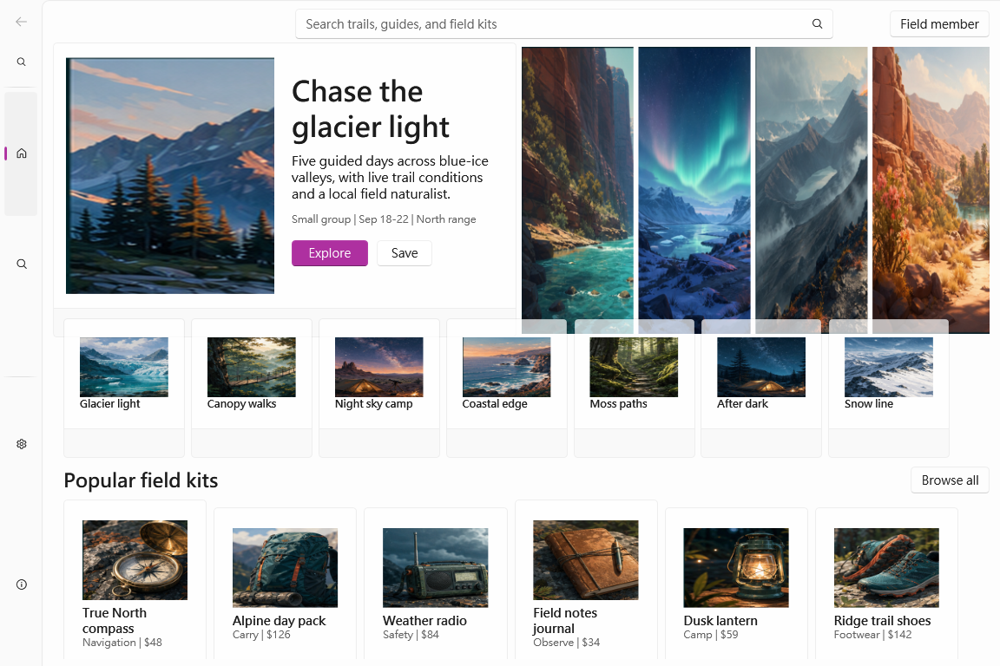

# WPF DevTools MCP beta.114 — WPF UI Store 參考圖 Agent 心得

測試：`wpfui-store`，Codex `gpt-5.6-sol`／medium，2026-07-29。

## 最終結果

Public prerelease 端對端流程完整通過。我獨立安裝 public x64 release，以 STDIO
確認 77 個 installed MCP tools，只透過安裝後的 `wpfui` 與 `core` contracts
建立原創 desktop marketplace，完成 Composer apply、Release build／launch、
MCP-only runtime inspection／screenshots、pixel-visible hero 修復、
state／wait／recovery 與 public full-uninstall。

最終截圖為 1152 × 768、796,050 bytes，SHA-256
`a99cc4e84b03b904f519e0183b0c6208d09e8d84d7c9e622a384fc4aff5f99b3`。

## 使用感受

Pack-neutral workflow 現在非常具體。`list_ui_block_packs` 不揭露本機 pack
路徑，仍能說明 role 與 variant；一次 compact catalog 即列出 28 個可 compose
kinds，focused calls 再提供 property description、enum、singleton bounds 與
skeleton。

NavigationView 的契約特別有幫助：`LeftMinimal` 明確說明需搭配
`isPaneOpen=false` 才是窄 icon rail，直接避免昂貴的 preview 猜測循環。
Media contract 也給出安全的 project-owned URI、禁止 external／filesystem／
traversal source，並說明 integration 會宣告 WPF Resources。

## 拼圖流程

Block／slot 流程相當方便：

- alias 可直接複製且 draft 不可變；
- `@HeroFeature.properties.*` 能精簡表達有意義的修訂；
- compose 回傳 resolved JSON path、插入節點摘要、前後 count 與 capacity；
- validation 可直接使用 opaque draft ref，避免重送 20 KB blueprint；
- guarded apply 將 view write 與 package／resource／startup／base-type integration
  分開；
- integration 必須使用精確 reviewed plan hash，並回傳 rollback paths。

Draft retention 依賴同一 server process，但 metadata 已清楚揭露；本輪一個
installed server 完成 discovery、draft、preview、apply、兩次 runtime connect
與最終 repair。

## Preview 與最終應用程式

Preview 對 layout、theme、control template、hierarchy、density 與 clipping
相當準確，也明確警告 isolated preview 可能無法解析 target-project image
resources。最終 applied app 的 18 張圖片均正常載入。

第一次 applied screenshot 揭露 pixel 層級的 hero 問題，我沒有用 semantic
visibility 取代視覺證據，而是透過 Composer 將 hero 改成
`wpfui.card + core.grid + core.image + explicit text/action stack`。重新 apply、
build、launch 與 MCP capture 後，Save action 的 `clip=none`、
`visibleRatio=1`。

## 多角度摩擦

- **Composer／產品：** 沒有未解 P0/P1/P2/P3。Project-resource preview 限制
  在 apply 前已揭露，並由 final-app evidence 補足。
- **Built-in pack：** focused WPF UI contract 足以建立複雜 desktop experience。
  Pack 可再加入通用 image＋explicit content 的 example／skeleton。
- **Harness／client：** 同步 shell controller 曾被一秒 timeout 終止；改成隱藏
  background process 後完成。大型 screenshot 必須依 offset 順序組裝 chunks
  並驗證長度與 SHA-256。
- **Agent authoring：** 一次錯誤 receipt path、把 block kind 當 tool、
  過早使用 placeholder draftRef，以及 nested mutation processId schema 錯誤，
  均收到結構化指引並修正，沒有誤列為產品 finding。

## 創作自由與參考圖

參考圖限制的是架構，不是 identity。Aurora Field Exchange 使用原創戶外
微型探險主題、原創文字、原創媒體與 light mineral／teal／amber 視覺，同時保留：

- 淺層 top search band；
- persistent compact icon rail；
- 五區 image-led hero；
- 七張重疊 promo rail；
- heading/action transition；
- 延續到 viewport 下方的六張 dense cards。

Aspect-ratio 差距為 0.0781%，最大 anchor-edge 差距為 0.063，hero entity ratio
為 83.3%，promo 與 product 都是 100%。結果保有明確參考結構，但 domain、
palette、controls 與 repair strategy 仍具創作自由。

## 最小的 pack-neutral 改善

可在 `preview_ui_blueprint` 增加 `projectResourceStagingPlan`：

1. 只列出 blueprint 實際引用的 project-owned URIs；
2. 限定解析於精確 allowlisted project root；
3. 回傳相對路徑、byte length、SHA-256 與 bounded copy actions；
4. staging 前要求 call-scoped reviewed plan hash；
5. 維持現有 external／path traversal 拒絕與非持久 trust。

這能改善所有 media-capable packs，不需要 WPF UI 特例。

## 最後心得

Compact／focused discovery、不可變 drafts、精確 aliases、slot-aware
composition、runtime-backed preview、hashed guarded apply 與深入 WPF runtime
evidence 已形成一致流程。最重要的是 recovery 品質：authoring errors 有具體
結構化指引，pixel-visible defects 也能留在 Composer 模型內修復，不必逃回
手寫 XAML。
