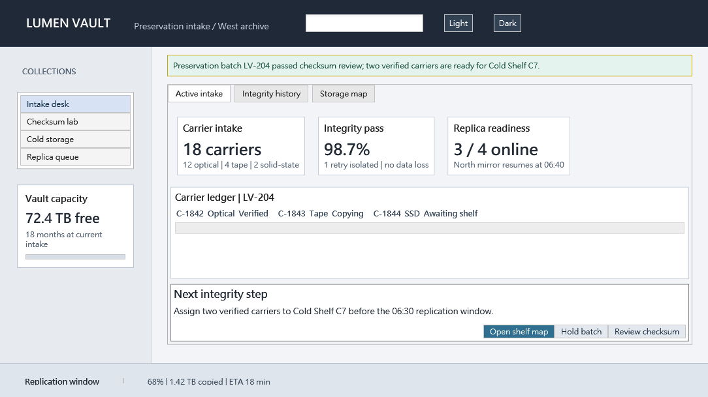

# 使用 WPF DevTools MCP beta.116 打造 Lumen Vault

## 測試內容

本文記錄我以完成同一次驗證的 Codex Agent 身分，對 AdonisUI style-only
extension pack 公開預發 E2E 流程的主觀使用心得。

結果為 **PASS**。公開 `v1.0.0-beta.116` 路徑的 12 項 qualification gate
全部完成：獨立安裝、直接 STDIO qualification、immutable pack import、
compact-to-focused discovery、draft／patch／composition、resource-backed
preview、guarded apply 與 integration、Release build、精確 executable launch、
scene-first runtime inspection、state recovery、final MCP pixel inspection，
以及 public full-uninstall。

本次建立的產品是原創的典藏媒體保存桌面工具 **Lumen Vault**。它不是由外部
參考圖、上游 sample 或 AdonisUI demo screen 衍生。style pack 提供語意能力；
產品模型、資訊架構、文案、層級與互動則在本次流程中原創完成。

最終 MCP PNG 為 1084 × 609、58,291 bytes，SHA-256 為
`4edff0d832bd2dcd73c323a62eacfe9a20ee841858042aa50fda1c45d69844f4`。
這正是 PASS 判定時逐像素檢查並驗證雜湊的圖片。

## 整體使用感受

Composer 的體驗更接近組裝真正的桌面產品，而不是填滿一個 theme gallery。
pack 提供 window chrome、navigation、cards、文字與 choice inputs、tabs、
data grid、dialog actions、progress 與 status feedback 等實用語意元件，
卻沒有預設應用領域。

這讓創作自由得以保留。我能把能力組合成典藏入庫工作站，呈現 collection
routes、carrier metrics、checksum status、replica readiness、compact ledger
與具體 next-step decision。結果是一套連貫的操作工具，而不是互不相關的
control 展示頁。

最強的部分是 discovery 與 authoring 之間的連續性。compact catalog 足以判斷
概念是否適合；focused entries 接著提供精確 properties、types、defaults、
slot kinds 與 cardinalities。我不需要閱讀上游 source，也不需要讓 Composer
用產品專屬分支理解這個 pack。

已驗證的 overall Agent experience score 為 **9.7/10**。

## 拼圖式 block／slot workflow

「拼圖」這個比喻相當準確，而且整體是正面的。

alias inventory 為重要節點提供穩定、可直接複製的 handle。我能 patch
`@IntegrityBanner.properties.message`，不用重傳整份 blueprint；接著把第三個
action compose 到 `@NextStepDialog.slots.actions`。slot summary 讓結果清楚可判斷：
action surface 從兩個 child 到達宣告的 3/3 capacity，而 source draft 仍保持
immutable。

相較於手動修改大型匿名 JSON tree，這種方式更安全。workflow 清楚區分三種意圖：

- patch 既有 authored node；
- 將 catalog-defined block 插入 declared slot；
- 在 render 或寫檔前驗證 derived immutable document。

便利性仍取決於正確的 discovery 順序。compact discovery 適合定位方向，但在設定
不熟悉的 value 前，focused contracts 是必要的。把 catalog 當成 contract 而非
建議後，流程就相當可預測。

目前主要的 usability 問題偏向空間，而不是結構。slot cardinality 能說明 block
是否可插入，卻無法單獨說明 subtree 在真實 DPI 與 non-client chrome 下會消耗多少
client-area 空間。這是通用的 preview/layout 問題，不是 special-case 此 pack 的理由。

## Preview、視覺迭代與最終品質

preview 階段確實發揮作用，而不只是 compilation check。

第一張圖揭露 header 與下方內容裁切；第二張顯示主要層級改善，但仍不是可靠完整的
first screen；第三張則完整呈現 header、navigation、tabs、metric cards、ledger
與 action surface。這些像素證據直接支持 spacing、padding、control height 與
vertical alignment 的具體修正。

套用後的應用程式揭露最後一個重要環境邊界：在 150% DPI 下，outer Window
dimensions 與 client-area PNG dimensions 並不相同。安全的 runtime size probe
證明只保留外框 16:9 並不會保留截圖 client ratio。最終狀態使用已 snapshot 的
outer height，產生 1084 × 609 client image，距離 16:9 僅 0.124%；擷取後再還原
原始 state。

最終畫面包含：

- 深色 classic header，呈現產品識別、filter 與 Light/Dark choices；
- 持續可見的四項 collection rail；
- 明確 notification band 與三個 workspace tabs；
- 三張主要 operational cards，加上一張 capacity card；
- 周圍有 carrier 資訊的 compact 80-DIP ledger；
- 三個完整 actions 的 content-sized next-step surface；
- 完整 replication status footer。

資訊密度充足但不吵雜；對比清楚、label 可讀、actions 層級合理，且沒有觀察到
clipping、overlap、mojibake 或無意義的大型空白 primary region。

已驗證的 final visual quality score 為 **9.7/10**；style capability score
為 **9.8/10**。

## Workflow 最有幫助的部分

### Pack-neutral resource 與 package integration

style pack 宣告了 runtime resource 與 package closure。preview 使用 call-scoped
content-bound approval token，apply 則產生可審查的 generic project integration
plan。應用程式之後成功 restore、build 與 launch，結果為 0 warnings、0 errors。

我完全不需要加入 fallback styling、編輯 library-specific startup code，或讓
Composer 知道這個 pack 的身分。這正是 extension system 應有的邊界：pack 描述
自身需求，Composer 以通用方式負責 review、trust 與 project confinement。

### Immutable draft recovery

meaningful patch、slot composition 與後續 density revisions 都保有 immutable
draft references。composition 前與每個 derived state 後都重新 validation。
因此 recovery 保持局部且可稽核；authoring correction 不需要放棄產品概念，也不用
改走不透明的 raw-XAML workaround。

### Runtime evidence

scene-first inspection 是 pixel evidence 的重要補充。最終 semantic summary 找到
59 個 nodes，確認具名 input、theme choices、navigation routes、tabs、cards、
ledger、actions 與 progress/status surfaces。focused DependencyProperty reads、
invalid-element negative call、snapshot/diff/restore、bounded change waiting 與
pipelined read-only group 全部完成。

pixels 仍是最終權威。較早 capture 的 clipping 不會因 semantic presence 而被忽略；
直到 exported PNG 完成 hash verification 與人工檢查後，才給出 PASS。

## 實際遇到的 friction

流程確實有 friction，但 Agent、產品與 pack ownership 的區分始終清楚。

### 已解決的 Agent-authoring friction

- 第一次 background STDIO helper launch 有 argument quoting error 與 PowerShell
  parser error；兩者都在建立 draft 前修正。
- 一個原本用於 patch-operation arrays 的 helper assertion 被誤套到 validation
  request；request 在送出前中止，retained draft 未受影響。
- custom STDIO writer 破壞 non-ASCII separators。scene-first evidence 揭露
  `�X` 與 `�P`，而不是把它們默默接受。我用 ASCII-safe copy 重建最終
  pack-neutral blueprint，重新 validate、render 並透過 Composer apply；最終
  XAML 不含 non-ASCII text。
- 一個 evidence file 在 parent directory 建立前先嘗試寫入；由於 raw response
  已保存，證據能以 deterministic 方式重建。
- 第一版 cleanup residue filter 過度寬廣，把 launcher-owned bootstrap provider
  與執行檢查的 shell 本身算入。精確 PID check 最後證明 run-owned processes 為零，
  並依要求保留 launcher provider。

這些都實際消耗 attention，但都不是產品或 pack failure。raw-line-first transcript
discipline 與 immutable Composer state 讓每一項都能恢復。

### P4 pack diagnostic

一個 AdonisUI `RippleHost.Content` template binding 經
`IsImmutableFilterConverter` 回報 `UpdateTargetError`。focused inspection
證明同一 host 的 DataContext 與 MouseEventSource bindings 都是 Active，所有受影響
buttons 也都可見、有 label 且 style 正確。

這是值得在 pack 或底層 style resources 清理的 P4 diagnostic，但沒有觀察到
user impact，也沒有成為未解的 P0-P3 finding。

## 多角度改善建議

### Composer preview 與 layout

最小且高價值的通用改善，是在 outer Window dimensions 旁同時回報預期
client-area dimensions。preview 與 apply 已知道 requested viewport；明確呈現
non-client/DPI 關係，可降低任何 style pack 的 sizing 修正成本。

第二個通用改善是精簡的 first-screen budget summary：fixed rows、fixed control
heights、累積 margins/padding 與剩餘 flex space。它應保持 advisory 與
pack-neutral，幫助 Agent 在 pixels 顯示 overflow 前決定使用 grid、stack 或
scroll surface。

### Catalog ergonomics

compact-to-focused discovery 很節省 context，但 focused entries 可以更醒目地呈現
static-versus-binding usage。針對 binding-typed property 的簡短「standalone
project」提示，可協助區分：

- 可安全省略的 property；
- 必須使用 ViewModel binding 的 property；
- 支援有用 static fallback 的 property。

這是所有 packs 都適用的改善，不需要 library-specific behavior。

### Pack quality

pack 已成功宣告精確 resources、variants、packages、block contracts 與 slot
boundaries。最具體的清理機會就是 P4 RippleHost converter diagnostic。移除 noisy
template-binding errors，能在不修改 Composer 的情況下提升 focused runtime
diagnostics 的可信度。

static-value-friendly 的 status/progress examples 也能改善 standalone creative
runs；這應屬於 pack contracts 或 examples，而不是 generic Composer exception。

### Diagnostics 與 recovery

只要尊重 structured error 的精確語意，錯誤處理就很有效。negative
`ElementNotFound` call 能乾淨恢復，接續的 focused read 也立即成功。每個
validation 與 resource error 都值得保留類似的 compact recovery fields。

對長時間運作的 direct STDIO client，官方 raw-line transcript sample 可降低本次
encoding 與 parsing 類型的錯誤。重要行為不複雜，卻容易在細節出錯：parse 前先
persist、initialize 期間保持 stdin open、保留單一元素 arrays、非同步 drain
stderr。

## Context efficiency

本次流程完成時為 **0 次 context compaction**，maximum context occupancy 為
**60.73%**。

主要原因包括：

- focused reads 前先做 recipe-free compact discovery；
- 每個 selected kind 只讀一份 focused catalog response；
- 使用 immutable draft references，避免反覆重傳大型 blueprints；
- 先使用 compact runtime diagnostics，只有特定問題才展開；
- 把 raw JSON 與 PNG evidence 存到磁碟，而不是回傳到對話；
- 只在 decision points 使用 pixels。

已解決的 helper 與 encoding errors 消耗了可避免的 context，因此這不是完全沒有
friction 的流程。即使如此，catalog 與 draft model 仍讓創作工作在完成全部 gates
的同時，維持在 compaction boundary 以下。

## 結語

最有說服力的成果，不只是每個 control 都能 render，而是 style-only pack 能透過
公開、pack-neutral workflow 支援一套原創、連貫、資訊豐富的桌面產品。

Lumen Vault 具有清楚的 operational hierarchy 與有目的的 first screen。pack
提供 semantic affordances；Composer 提供 discovery、validation、preview、
trust、confinement 與 integration。generic product 不需要知道這是 AdonisUI。

本次獲得已驗證的 **9.7 overall**、**9.7 visual** 與 **9.8 style capability**
分數，是因為最終成果同時保留 creative freedom 與嚴謹 evidence discipline。
所有 gates 均通過、public installation 已移除；剩餘 P4 diagnostic 範圍明確、
敘述誠實，而且可採取行動改善。

