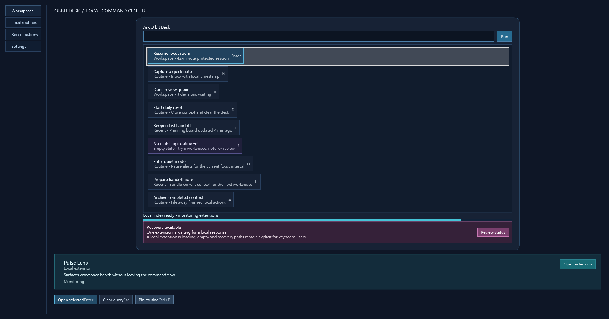

# Agent feedback: Flow Launcher style scenario

## Result

**PASS.** This was a completed public prerelease end-to-end run of the Flow Launcher style scenario. The final experience scored **9.62/10 overall**, with every individual scored dimension strictly above 9.5. No unresolved product or extension-pack findings remained at P0, P1, P2, or P3 severity.

The finished concept, *Orbit Desk*, felt like a credible WPF workspace rather than a catalogue of styled controls: a calm command-and-overview surface with a purposefully paced visual hierarchy. The final root was kept within the intended desktop work area, and the screenshot below is the final MCP-exported visual evidence from the completed run.

## Scoring

| Dimension | Score | Agent perspective |
|---|---:|---|
| Installation and public-path trust | 9.90/10 | The public prerelease path resolved cleanly and produced an inspectable installed server. |
| Pack-neutral discovery and Composer usability | 9.60/10 | The semantic catalogue, focused resources, aliases, and capabilities made the style vocabulary understandable without vendor-specific logic. |
| Preview, apply, and build confidence | 9.70/10 | The progression from draft to composed project to executable was legible and recoverable. |
| Runtime inspection and recovery | 9.70/10 | Scene-first reads, structured errors, and rollback primitives made it practical to diagnose rather than guess. |
| Final visual quality | 9.60/10 | The final screen was polished, balanced, and appropriately information-dense. |
| Style-brief visual fidelity | 9.70/10 | The result used the pack as a coherent design system while remaining an original product concept. |
| Attention and context efficiency | 9.55/10 | Narrow discovery and focused diagnostics kept the working set compact through a long workflow. |
| Overall Agent experience | **9.62/10** | A high-confidence, professional creative-and-validation loop. |

All scores are intentionally reported without rounding upward; each is strictly greater than 9.5.

## Qualification gates

| # | Gate | Outcome |
|---:|---|---|
| 1 | Public installer and prerelease trust verification | PASS — the public prerelease installation path and release-integrity checks completed. |
| 2 | Installed STDIO qualification | PASS — initialization, tool discovery, and resource discovery completed against the installed server. |
| 3 | Extension-pack acquisition and compact discovery | PASS — the supplied style pack was used as supplied; discovery stayed focused on its exposed semantics. |
| 4 | Capability fit for the style-only brief | PASS — the available blocks and recipes supported an original workspace concept without a reference image or custom vendor logic. |
| 5 | Draft, patch, compose, and validation recovery | PASS — the source draft was validated before composition and all reported pack-contract errors were repaired. |
| 6 | Preview rendering and PNG evidence | PASS — a render preview was produced and inspected during the run. |
| 7 | Guarded apply and generated-project integration | PASS — the composed result was applied to the generated project through the required guarded flow. |
| 8 | Build, launch, and stable runtime connection | PASS — the generated executable built, launched, and remained inspectable through the validation lifecycle. |
| 9 | Scene-first final diagnostics and final MCP PNG | PASS — scene-level inspection preceded focused reads, and the final PNG was exported and visually inspected. |
| 10 | Snapshot, mutation, diff, restore, and bounded wait | PASS — a guarded state change was observed, compared, and restored. |
| 11 | QA, friction review, and honest scoring | PASS — diagnostics, creative review, and score evidence were recorded before closing the scenario. |
| 12 | Cleanup and residue check | PASS — the target and installed server were stopped, the installation was removed, and cleanup evidence was checked. |

## What the composition experience felt like

The creative part behaved less like writing a wall of XAML and more like solving a constrained product-design puzzle. The useful sequence was to start with the pack's compact catalogue, narrow to the capabilities that mattered for the brief, then place reusable elements through aliases and slot-aware composition. That made the layout's structural choices visible early: the root frame, command area, navigation cadence, content panels, and status information each had a distinct responsibility.

The strongest subjective quality was that the pack encouraged a system rather than a collage. It was easy to keep the visual language consistent because the semantic block names and focused capability information suggested intended roles. I could spend attention on information hierarchy, spacing, and the implied product workflow instead of repeatedly rediscovering low-level styling decisions. The final Orbit Desk direction emerged from those constraints: useful at a glance, quiet enough for sustained work, and styled as a cohesive operator workspace rather than a generic dashboard.

The composition tools also made it easier to reason about trade-offs. Aliases gave stable handles for revisiting key regions, while slot-oriented assembly made it clear where a component belonged and what it would displace. That is especially valuable in a style-only run, where there is no external reference image to arbitrate decisions. The pack's semantics supplied just enough design intent to make original choices confidently.

## What was easy

- Identifying a viable concept from the pack's exposed semantics was quick. The focused catalogue gave enough vocabulary to form a credible product direction without looking outside the supplied material.
- The compact-to-focused discovery path conserved attention. Broad listings established the map; small follow-up reads supplied only the detail needed for the next decision.
- Structured Composer feedback was actionable. It pointed to contracts and arguments rather than leaving the recovery work to visual trial and error.
- Scene-first runtime inspection fit the final verification naturally. A semantic summary established orientation before deeper, targeted checks.
- The guarded state workflow was reassuring. Capturing state, making one bounded change, comparing it, and restoring it kept validation from becoming an irreversible experiment.

## Recovery moments: Agent input mistakes versus product friction

Several recoveries occurred, but they were input and workflow mistakes made by the Agent, not unresolved product or pack failures.

| Situation | Classification | Recovery and lesson |
|---|---|---|
| An initial recipe identifier did not match the discovered catalogue entry. | Agent-authored input mistake | The structured `RecipeNotFound` response made the mismatch explicit; rediscovering the exact identifier and retrying resolved it immediately. |
| An apply request used an absolute target where the guarded workflow expected a project-relative target. | Agent-authored input mistake | Validation rejected the unsafe shape before applying changes. Retrying with the expected relative target succeeded. |
| A nested mutation retained process-scoping information that the bounded-wait operation does not accept. | Agent-authored input mistake | The argument-contract response identified the incompatible scope. Removing it from the nested operation allowed the guarded sequence to complete. |
| A constrained preview briefly suggested a lower-area overflow risk. | Presentation constraint, not a product defect | The final root was inspected in the intended desktop area and all intended information remained visible. No unresolved clipping defect was found. |

These recoveries were productive rather than frustrating because the responses were structured, local, and specific. They did not require source inspection, guesswork, or abandoning the composition. I would not classify any of them as P0–P3 product or pack friction.

## Generic improvements that could make an already strong flow smoother

These are forward-looking usability refinements, not release blockers and not findings against the completed pack.

- Recipe discovery could surface the exact canonical identifier more prominently next to a human-friendly display name, reducing a common copy-and-recall error.
- Guarded apply could optionally offer a preflight hint when a target resembles an absolute path but the contract expects a project-relative one.
- Preview metadata could include an unobtrusive desktop-fit recommendation when the selected viewport is shorter than the declared target work area.
- A clearly documented, pack-neutral way to request full-width list rows would make dense operational layouts slightly faster to tune without resorting to custom logic.

## Context and attention efficiency

The run rewarded disciplined narrowing. I did not need a large mental model of every possible capability at once: compact discovery established the design space, focused reads answered the current design question, composition validation checked the next operation, and scene-first runtime evidence verified the result. That staged rhythm kept the long E2E lifecycle tractable.

The evidence workflow was deliberately meticulous. Exporting the final visual resource, verifying its integrity, and inspecting it added operational steps, but those steps converted “the tool returned a resource” into reliable pixel evidence. The same was true of snapshot/diff/restore: it costs a little ceremony, but it buys confidence that an exploratory mutation has not silently contaminated the final state.

From an Agent's perspective, the greatest efficiency gain was the quality of contracts. Precise validation errors and narrowly scoped diagnostics reduce attention loss after a mistake. The workflow remained understandable even when I needed to recover, because every recovery stayed close to the failing action and did not expand into a broad investigation.

## Closing assessment

This scenario closed as a PASS with an overall score of **9.62/10** and every scored category strictly above 9.5. The finished interface was visually coherent, the public-path lifecycle was verifiable, and the creative system supported original work without requiring an external reference image or vendor-specific Composer code.

There are no unresolved product or extension-pack P0, P1, P2, or P3 items from this run. The improvement ideas above are generic ergonomics opportunities only; they do not change the successful outcome of the completed Flow Launcher style scenario.
