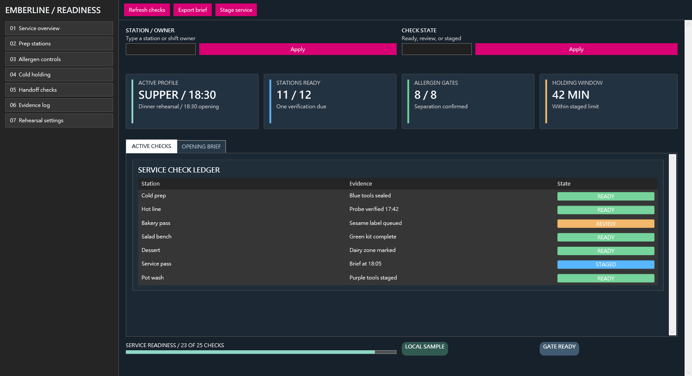

# 使用 WPF DevTools MCP beta.116 打造 Emberline Kitchen Readiness

本文記錄同一位 Codex Agent 以 immutable `networkmanager-style` 0.1.1 extension
pack 完成公開預發 E2E 後的主觀心得。

本輪沒有參考圖片；pack 的 admin shell、navigation、commands、filters、
profiles、metrics、diagnostic table、tabs、progress 與 status 能力就是創作
brief。最後產生的 **Emberline Kitchen Readiness** 是原創的社區廚房過敏原安全
演練工具，而不是另一個網路管理介面。

上圖是 Release-built App 透過 MCP 擷取的原始 PNG，尺寸為 1584 × 861、
77,932 bytes，SHA-256 為
`c691de0505b3e5750b446096d484706fc7ee3a785e4b94e0b02650a31876e061`。

## 公開安裝與 discovery

非互動式 installer 正確解析 beta.116、下載 x64 GitHub asset、驗證 release
checksum、安裝到隔離根目錄，並只輸出要求的 `other` artifact。直接 STDIO
initialization 使用 newline-delimited JSON-RPC，server 回報 beta.116 與 77 個
tools。

Compact discovery 先用 12 個有意義的名稱與數值限制幫助我選擇創作概念，
focused reads 再提供實際需要的 properties、slot cardinalities 與 defaults。
整個流程不需要從 library 名稱推測契約，也不需要查看上游 source。

## Composer 拼圖是否方便

答案是肯定的：

- packs 定義可用拼圖；
- focused catalog entries 精確說明拼接邊界；
- slots 清楚列出允許的連接方式；
- aliases 讓後續修改不需複製大型 JSON；
- immutable draft references 讓複雜 blueprint 留在 server process；
- composition 會回報插入結果與剩餘容量。

我建立一個真正的 draft，透過 alias 修改 profile 文案，先驗證再把第七筆
diagnostic row 組合進 `@ActiveChecks.slots.rows`。來源 draft 維持 immutable，
衍生結果也通過乾淨驗證。

## Preview 如何改善成品

第一張 preview 在技術上成功，卻把 diagnostic table 推到首屏以下。這種問題
只看 semantic completeness 會被漏掉。Focused `core.grid` contract 讓我把 metrics
與 filters 重排成適合寬螢幕的列；後續 preview 顯示完整七筆 ledger，最後一次
文案調整也排除了 clipped shell/profile text。

實際 1600 × 900 runtime 又揭露 selected tab 的 host-native light surface 與
footer 資訊密度問題。我只使用已 discovery 的 blueprint properties 與通用
layout blocks 修復，並重新 validate、render、dry-run apply、confirmed apply、
Release build、launch 與 MCP screenshot。Generated XAML 從未手動修改。

## 特別好用的部分

`networkmanager-style` 提供 admin surfaces，`core.grid` 與 `core.border` 只負責
空間結構，Composer 不需要任何 NETworkManager 專用分支。`apply_ui_blueprint`
會先提供受限 file plan 與 deterministic integration hash，confirmed apply
也會建立 backup。

Release build 為 0 warning、0 error。Fresh installed server 能連線精確 executable、
回傳 90-node scene summary、直接找到命名元素、確認 0 binding errors，並將
最終像素以 MCP resource 輸出。

狀態安全流程同樣清楚：先捕捉選取 profile 的 Opacity 與 focus，將值改為 0.72，
在 28 ms 內等到預期變化，檢查單一 DP diff，最後恢復為 1 且沒有 warning。

## 多角度摩擦與建議

### Pack

Selected-tab background token 在這輪沒有真正控制 host-native selected surface。
我以深色 selected foreground 保持最終文字可讀，但未來 pack 若能讓 selected
background 與 foreground 都具視覺權威性，結果會更可預測。

此外，admin-shell content slot 的簡單預設適合一般案例；寬版操作工具則可考慮
提供一個 dense grid starter skeleton，減少第一次 preview 的重排成本，又不必
限制產品概念。

### Composer

最小且通用的改善是提供 StackPanel-rooted composition 的 viewport-fit estimate，
例如預估最後幾個 blocks 是否會落到 720-DIP viewport 之外。這可以保持
pack-neutral，同時幫助 Agent 更早選擇 grid。

### Agent workflow

Screenshot URI 只是中繼點。Agent 仍須依序讀取 chunks、重建 PNG、核對 bytes
與 SHA-256，再實際檢查像素。呼叫次數較多，但能防止 semantic summary 隱藏
contrast 與 density 問題。

## 創作自由與結語

Pack 沒有強迫上游產品身分。我將它組合成七個 kitchen routes、兩個 filters、
四個 readiness metrics、雙 tab service ledger、七項 deterministic checks、
一個 progress 與兩個 status facts；沒有上游 branding、copied screen、icon、
network scan 或 credential。

Beta.116 的 Composer 體驗像是在組裝 typed visual system，而不是產生一整塊
不可控 XAML。這輪最終視覺品質為 9.7/10、style capability fidelity 為 9.8/10、
整體 Agent 體驗為 9.7/10。
