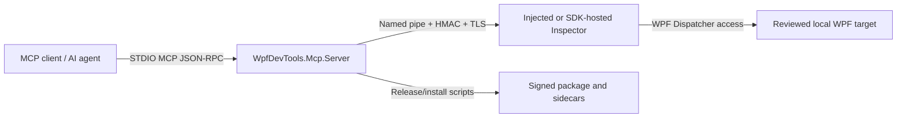
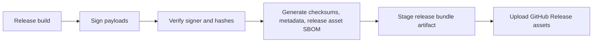

# Threat Model

本頁整理 WPF DevTools MCP 的生產環境威脅模型。內容刻意保持精簡，方便外部 reviewer 對照風險、控制措施與剩餘假設。

## Security boundary

WPF DevTools MCP 是本機除錯工具。支援的 trust boundary 是同一個 Windows 使用者執行已審查的 MCP server，並只連線到已審查的本機 WPF target。即使 MCP client 是可信任桌面程式，server 仍必須把 MCP client 視為 untrusted input，因為 prompts、tool descriptions 與 model context 可能被 prompt-injected。

真正的安全決策必須在 server-side policy gates。Client guidance、tool annotations、examples 與 prompts 只是不具強制力的 usability hints。

## Architecture diagram

## Trust-boundary table

| Boundary | Trusted side | Untrusted side | Control |
| --- | --- | --- | --- |
| MCP STDIO | server typed request filters | MCP client prompts、tool calls 與 raw JSON-RPC envelope | SDK 解析 envelope；server 在解析後執行 tool gates。 |
| Target selection | 已審查的 exact local executable paths | discovered process metadata 與 denied targets | `WPFDEVTOOLS_MCP_ALLOWED_TARGETS`，metadata disclosure 前先 redaction。 |
| Inspector IPC | 已驗證的 server 與 inspector | 同使用者的 local pipe impersonators | HMAC、TLS thumbprint pinning、PID 與 compatibility checks。 |
| Raw injection | signed local payloads 與 allowlisted target | wrong architecture、stale PID、被替換的 payload paths | architecture preflight、path validation、signature/integrity checks。 |
| Release chain | signed artifacts 與 generated sidecars | modified archive、stale SBOM、missing checksum | signer trust、hash sidecars、release asset inventory、staged upload parity tests。 |

## Data-flow table

| Flow | Sensitive data | Primary limits |
| --- | --- | --- |
| `connect()` / `get_processes` | process names、executable identity、window titles | target allowlist、denied counts redaction、只接受 exact local paths。 |
| scene and binding reads | UI text、DependencyProperty values、binding data | sensitive-read gate、output caps、compact response modes。 |
| screenshots | target pixels 與 retained PNG files | screenshot gate、預設 metadata/file mode、server-owned resource root、retention window。 |
| mutation tools | live UI 與 ViewModel state changes | destructive gate、snapshot/diff/restore workflow、structured cleanup fields。 |
| release publishing | package archives、checksums、signer metadata、release asset SBOM | trusted signer policy、sidecar parity、staged artifact upload checks。 |

## Attacker capability matrix

| Attacker | Assumed capability | Not assumed |
| --- | --- | --- |
| Prompt-injected MCP client | 可以呼叫 registered tools 並要求誤導性 workflow。 | 不能繞過 server-side gates 或 target allowlists。 |
| Same-user local process | 可以檢查 user-writable files 並競爭 local processes。 | 若沒有 matching secrets 與 target identity，不能繞過 HMAC/TLS/PID checks。 |
| Malicious target process | 可以呈現誤導性 UI/runtime data，或 host incompatible SDK pipe。 | 未經 exact target policy configuration，不能自行成為 allowlisted target。 |
| Release tamperer | 可以修改 unsigned local copies，或在發佈前漏掉 artifacts。 | 沒有 release credentials 時，不能產生 trusted signer metadata 或 matching generated sidecars。 |

## Release-chain diagram

## Accepted-risk register

| Risk | Status | Owner | Accepted date | Revisit date | Rationale |
| --- | --- | --- | --- | --- | --- |
| Same-user code remains inside the local trust boundary. | Accepted with controls | Release owner | 2026-06-01 | 2026-09-01 | 這是本機 debugger；DPAPI、ACLs、HMAC/TLS 與 redaction 可降低意外曝露，但不承諾防禦已完全入侵的同使用者程式。 |
| Raw injection remains an emergency path. | Accepted with opt-in | Release owner | 2026-06-01 | 2026-09-01 | 部分 WPF target 無法 host SDK。Raw injection 必須有 exact target allowlists、matched architecture 與 trusted local payloads。 |
| STDIO is single-session only. | Accepted until transport redesign | Release owner | 2026-06-01 | 2026-09-01 | HTTP/SSE 或 multi-client transport 在 production 使用前，需要明確的 session isolation work。 |

## Security contact

若懷疑有 vulnerability，請對 repository owner 建立 private GitHub Security Advisory。請包含受影響版本、commit SHA、重現步驟，以及是否涉及 public release artifact。Do not publish exploit details、screenshots、target UI data、certificate material 或 auth secrets 到公開 issues，直到 maintainer 完成 triage。

## Threats and Mitigations

| Threat | Risk | Mitigations |
| --- | --- | --- |
| MCP client as untrusted or prompt-injected caller | client 可能在使用者意圖之外要求 sensitive reads、screenshots、mutations 或 process discovery。 | target allowlists、sensitive-read gates、screenshot gates、destructive-tool policy gates、structured error contracts，以及 process metadata disclosure 前的 server-side validation。 |
| same-user local attacker | 以同一個 Windows 使用者執行的程式可能讀取本機檔案、environment variables、pipes 或 process state。 | local-only path validation、DPAPI-protected default secrets、persisted auth/cert files 的 protected ACLs、named-pipe authentication、TLS certificate pinning，以及 redacted default logs。 |
| malicious target process | target 可能暴露誤導性的 UI state、消耗 diagnostic payload，或啟動不相容的 SDK pipe。 | exact target allowlists、runtime compatibility checks、output caps、timeout handling、secure transport validation，以及 fail-closed SDK transport configuration。 |
| fake named-pipe / MITM server | 本機 process 可能冒充 Inspector pipe 以攔截 commands 或偽造 responses。 | process-derived pipe names、HMAC challenge-response、TLS certificate validation、host compatibility ping、PID validation，以及 adversarial fake-pipe regression tests。 |
| raw injection risk | DLL injection 可能失敗、打到錯誤 process，或跨過 architecture/security boundary。 | exact injection allowlists、`OpenProcess` 前的 architecture preflight、trusted local payload path validation、release signature/integrity checks，以及 target app 可 opt in 時優先採用 SDK-hosted mode。 |
| screenshot, ViewModel, and runtime data exfiltration | UI text、screenshots、binding values、ViewModel data 與 state snapshots 可能含有 secrets。 | `WPFDEVTOOLS_MCP_ALLOW_SENSITIVE_READS`、`WPFDEVTOOLS_MCP_ALLOW_SCREENSHOTS`、compact text fallback、省略 base64/log text fallback fields、local path redaction，以及 resource retention limits。 |
| supply-chain and release tampering | 被竄改的 package 或 installer 可能註冊惡意 MCP server。 | signed payload verification、package hash sidecars、canonical release metadata、SBOM sidecars、package-local integrity checks，以及 uninstall 後 residue checks。 |
| unsupported future HTTP/SSE multi-session transport | 若把 static process-wide caches 與 STDIO session assumptions 直接用於 multi-session transport，可能造成跨 client state leakage。 | 目前 production support 僅限 STDIO single-session。HTTP/SSE 在啟用前必須先把 session-specific state 移到 DI/request/session scope，並加上 isolation tests。 |

## Out of scope

- 防禦已用更高權限執行的 administrator 或 malware。
- 讓 raw injection 可安全套用在任意未審查 target。
- 支援 Native AOT 或 self-contained single-file injection。
- 把 screenshots、ViewModel values、binding values 或 state snapshots 視為非敏感資料。
- 在完成明確的 multi-session isolation work 前，把未來 HTTP/SSE transport 視為 production-ready。

## Review checklist

- 確認 `WPFDEVTOOLS_MCP_ALLOWED_TARGETS` 與 `WPFDEVTOOLS_INJECTION_ALLOWED_TARGETS` 只包含已審查的 exact local executable paths。
- 除非目前診斷 session 明確需要，否則保持 sensitive reads、screenshots 與 destructive tools 關閉。
- 可讓 app opt in 時優先採用 SDK-hosted Inspector；只有在 target 已審查且 architecture matched 時才使用 raw injection。
- 一般診斷優先使用 file 或 metadata screenshot output；只有 payload 明確很小時才使用 inline base64。
- 發佈或安裝 production package 前，驗證 release archives、checksums、signer metadata 與 SBOM sidecars。
